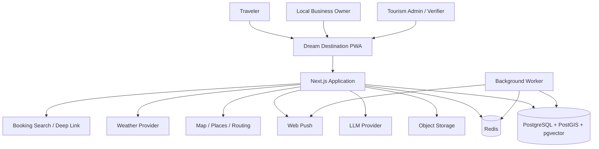
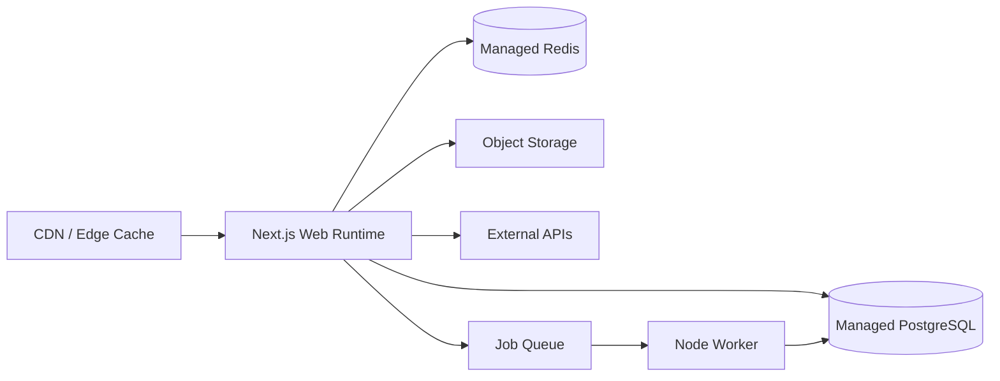
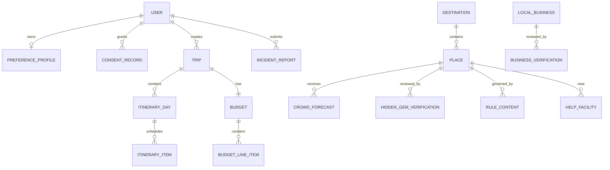
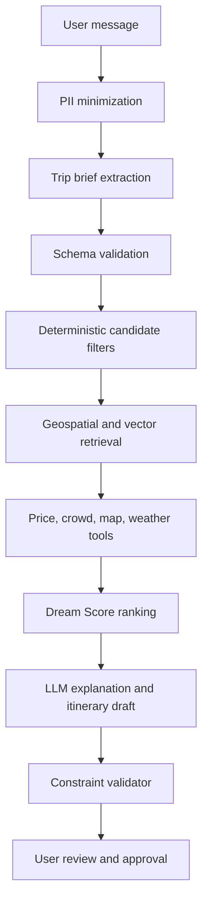

# Dream Destination

## Unified Product Requirements Document

**Version:** 1.0  
**Status:** Development baseline  
**Prepared for:** Smart India Hackathon  
**Primary platform:** Mobile-first Next.js Progressive Web App  
**Primary users:** Travelers aged 18–40, local business owners, tourism administrators, and community stakeholders  
**Document date:** 21 September 2026

---

## Contents

- [Document purpose and product outcome](#1-document-purpose)
- [Release definition](#3-release-definition)
- [Implementation decisions](#4-implementation-decisions)
- [Capability traceability](#5-capability-traceability)
- [Document governance](#6-document-governance)
- [Part I: Product Experience and UI/UX](#part-i-product-experience-and-uiux)
- [Part II: Technical Architecture and Database](#part-ii-technical-architecture-and-database)
- [Part III: Development Backlog and User Stories](#part-iii-development-backlog-and-user-stories)
- [Appendix A: Unified Release Checklist](#appendix-a-unified-release-checklist)
- [Appendix B: Source Consolidation Note](#appendix-b-source-consolidation-note)

## 1. Document Purpose

This document is the single implementation PRD for Dream Destination. It consolidates the approved UI/UX specification, technical architecture and database specification, and prioritized development backlog into one decision-ready source for product, design, engineering, QA, and SIH evaluation.

It defines:

- what users must be able to accomplish;
- what screens, states, components, and accessibility behavior must exist;
- how the Next.js PWA, AI services, data model, APIs, offline behavior, and security controls must work;
- what the team builds first, how work is accepted, and what is deferred;
- how every major capability connects traveler value with local economic and community impact.

## 2. Product Outcome

Dream Destination helps a traveler move from an open-ended travel idea to a trusted, budget-aware and executable itinerary. It combines conversational planning, explainable destination matching, crowd visibility, local-business discovery, verified destination information, nearby safety facilities, sourced legal guidance, offline trip access, and contextual notifications.

The SIH build must prove four outcomes:

1. A traveler can generate and meaningfully edit a usable trip plan in under three minutes.
2. Budget, crowd, safety, legal and verification information remains visible and traceable instead of being hidden inside AI prose.
3. Local businesses and community experiences appear inside the itinerary at relevant decision points.
4. The complete journey remains technically credible under constrained data, intermittent connectivity, and external-provider failure.

## 3. Release Definition

### 3.1 SIH MVP

The MVP is a focused pilot for one state or two nearby districts. It includes a curated catalog of destinations, hidden gems, local businesses, public rules, help facilities, and crowd fixtures sufficient to demonstrate the end-to-end product logic.

The required demonstration journey is:

> Ask Dream AI → confirm the structured brief → compare destinations → inspect Dream Score → set the budget → generate and edit the itinerary → view map, crowd and trust information → save an offline trip pack → enter Trip Mode → discover or add a local business → access nearby help.

### 3.2 Priority model

| Priority | Release interpretation |
|---|---|
| P0 | Required for a complete and credible SIH demonstration |
| P1 | Required for a supervised pilot or implemented when P0 is stable |
| P2 | Post-pilot enhancement dependent on evidence, partners, or scale |

### 3.3 Explicit MVP boundaries

The MVP does not process payments, guarantee live inventory, autonomously confirm bookings, store passports or Aadhaar, retain detailed medical documents, expose unverified hidden locations, or perform continuous background location tracking. Provider deep links, sandbox responses, seeded fixtures, and clearly labelled fallback states are acceptable for the SIH demonstration.

## 4. Implementation Decisions

| Decision area | Approved direction |
|---|---|
| Frontend | Next.js with TypeScript, responsive mobile-first interface and PWA capabilities |
| Application shape | Modular monolith for SIH and pilot, with explicit module boundaries for later extraction |
| Data | PostgreSQL with PostGIS and pgvector; Redis for caching, jobs and rate controls |
| AI | Provider-neutral LLM gateway using structured outputs, approved retrieval and deterministic validation |
| Recommendations | Explainable Dream Score computed by application logic, not by unvalidated AI generation |
| Crowd | Hybrid observations and rules with confidence, freshness, provenance and an explicit Unknown state |
| Booking | Comparison and provider handoff; no direct settlement in the MVP |
| Offline | Installable PWA with versioned trip packs and conflict-aware synchronization |
| Security | Least privilege, consent controls, audit events, minimal sensitive data and source-level trust metadata |
| Delivery | P0 vertical slice first, followed by trust, local impact, resilience and pilot hardening |

## 5. Capability Traceability

| Capability | User and ecosystem value | Primary UX coverage | Architecture ownership | Delivery epic | MVP |
|---|---|---|---|---|---|
| Dream AI and trip brief | Converts intent into structured planning inputs | T03 | Dream AI, Trips | E04 | P0 |
| Dream Score and shortlist | Makes destination matching explainable | T04–T07 | Recommendations | E05 | P0 |
| Budget planning | Keeps the plan within a declared range | T08 | Budget | E06 | P0 |
| Itinerary and map | Produces an editable, geographically coherent plan | T09–T10, T14–T16 | Trips, Maps | E07 | P0 |
| Crowd intelligence | Helps travelers choose safer and more comfortable times | T04, T06, T09, T17 | Crowd | E08 | P0 |
| Hidden-gem verification | Prevents unsafe or unsuitable discovery | T11, A02–A03 | Verification | E09 | P0/P1 |
| Local-business discovery | Directs qualified traveler attention to nearby enterprises | T12, B01–B06 | Businesses | E10 | P0/P1 |
| Rules, stories and nearby help | Improves cultural readiness, compliance and safety | T18–T20 | Content, Help, Retrieval | E11 | P0 |
| Offline and notifications | Supports active travel with weak connectivity | T17, T21–T22 | Offline, Notifications | E12 | P0/P1 |
| Booking handoff | Connects the plan to external providers without false confirmation | T13 | Booking adapters | E13 | P1 |
| Impact and operations | Measures traveler value, trust and local economic discovery | A01, A04–A08 | Analytics, Administration | E14 | P0/P1 |
| Quality and demo readiness | Establishes security, accessibility, resilience and evidence | Global | Cross-cutting | E15 | P0 |

## 6. Document Governance

This unified PRD settles scope in the following order:

1. The release definition and priority model determine whether work belongs in the current release.
2. Detailed backlog acceptance criteria determine whether a story is complete.
3. UI/UX specifications determine visible behavior, interaction states and accessibility expectations.
4. Technical architecture determines service boundaries, data rules, security controls and integration behavior.
5. When two requirements conflict, the safer and more transparent behavior takes precedence until the product owner records a decision.

Changes affecting P0 scope, personal data, public safety, verification, booking claims or production integrations require product and technical-lead approval.

## 7. How to Use This PRD

- Product owners use the release definition, traceability table, backlog and release gates to control scope.
- Designers use Part I as the interaction and handoff contract.
- Engineers use Part II as the implementation and data contract.
- Delivery leads use Part III for estimation, sprint sequencing and dependency management.
- QA uses screen acceptance criteria, story acceptance criteria, architecture criteria and release gates together.
- SIH reviewers can follow the capability traceability table from intended impact to visible experience and feasible implementation.

---

# Part I: Product Experience and UI/UX

## 1. Experience Goal

Dream Destination should make an unfamiliar trip feel exciting and manageable. The interface must help a traveler move from inspiration to a trusted plan without switching between booking, mapping, budget, safety, and local-discovery tools.

The experience must balance two emotions:

- **Excitement:** photography, discovery, local stories, hidden places, and personal recommendations.
- **Confidence:** visible budget, current crowd status, verified safety attributes, sources, timestamps, and nearby help.

The primary experience promise is:

> A traveler can describe a trip, compare suitable destinations, build an itinerary within budget, and carry the essential plan offline.

---

## 2. UX Principles

1. **Show a useful draft quickly.** Ask only for information that changes the recommendation.
2. **Keep the traveler in control.** AI suggestions always support edit, accept, and dismiss actions.
3. **Explain recommendations.** Every recommendation must show why it matches.
4. **Display trust at the decision point.** Verification, freshness, source, and limitations belong beside the relevant claim.
5. **Use progressive disclosure.** Start with the next decision and allow deeper inspection.
6. **Make budget persistent.** Remaining budget stays visible during itinerary changes.
7. **Separate planning from booking.** “Add to trip” and “Check booking options” are different actions.
8. **Reduce the interface during travel.** Active Trip Mode prioritizes the next step, navigation, alerts, offline state, and help.
9. **Never rely on color alone.** Crowd and safety states require text and icons.
10. **Respect weak connectivity.** Show cached content timestamps and provide graceful offline behavior.

---

## 3. Primary Information Architecture

### 3.1 Main traveler navigation

| Navigation item | Purpose | Default destination |
|---|---|---|
| Home | Inspiration and fast trip entry | Personalized home feed |
| Explore | Search, filters, map, and destination discovery | Map/list results |
| Dream AI | Conversational trip planning | New or active planning conversation |
| Trips | Draft, upcoming, active, and completed trips | Trip library |
| Profile | Preferences, privacy, notifications, language, and help | Profile overview |

### 3.2 Active Trip Mode navigation

When a trip starts, replace the standard bottom navigation with:

| Item | Purpose |
|---|---|
| Next | Current and upcoming itinerary item |
| Map | Route and nearby places |
| Alerts | Crowd, weather, closure, and checklist updates |
| Help | Emergency numbers, nearby facilities, and location sharing |

The user can exit Trip Mode without ending the trip.

### 3.3 Administration navigation

| Section | Purpose |
|---|---|
| Overview | Operational summary and urgent review items |
| Destinations | Destination and place catalog |
| Verification | Hidden-gem and business review queues |
| Crowd | Forecasts, observations, and manual overrides |
| Content | Rules, stories, sources, and freshness |
| Businesses | Local-business onboarding and status |
| Incidents | Reports, triage, and suspensions |
| Analytics | Traveler interest and local-business outcomes |

---

## 4. Design System

### 4.1 Color tokens

| Token | Value | Use |
|---|---|---|
| `brand.deep` | `#17324D` | Headings, navigation, high-trust surfaces |
| `brand.primary` | `#0F766E` | Primary actions and selected states |
| `brand.primary-hover` | `#0B5F59` | Hover/pressed state |
| `brand.saffron` | `#F28C28` | Discovery accents and limited emphasis |
| `surface.base` | `#FFFFFF` | Primary background |
| `surface.warm` | `#FFF8EF` | Editorial and travel-story sections |
| `surface.subtle` | `#F5F7F8` | Secondary panels and filters |
| `text.primary` | `#17202A` | Main copy |
| `text.secondary` | `#5F6B76` | Supporting copy |
| `border.subtle` | `#DDE4E8` | Borders and separators |
| `status.good` | `#14804A` | Comfortable crowd and verified states |
| `status.warn` | `#B77900` | Moderate crowd and caution |
| `status.danger` | `#C9362B` | Heavy crowd, closure, and urgent alerts |
| `status.unknown` | `#667085` | Unknown or stale information |

### 4.2 Typography

- **Primary UI font:** Manrope Variable.
- **Fallback:** Inter, system sans-serif.
- **Indian-language scripts:** Noto Sans family for the selected script.
- **Body minimum:** 16 px on mobile.
- **Metadata minimum:** 14 px.
- **Touch target minimum:** 44 × 44 CSS pixels.

| Style | Mobile | Desktop | Weight |
|---|---:|---:|---:|
| Display | 40 px | 56 px | 750–800 |
| H1 | 32 px | 42 px | 700 |
| H2 | 26 px | 32 px | 700 |
| H3 | 21 px | 24 px | 650 |
| Body | 16 px | 17 px | 400 |
| Small | 14 px | 14 px | 450 |
| Label | 13 px | 13 px | 650 |

### 4.3 Spacing and geometry

- Base spacing unit: 4 px.
- Mobile horizontal page padding: 16 px.
- Tablet: 24 px.
- Desktop content maximum: 1200 px with 32 px page gutters.
- Card radius: 16 px.
- Bottom sheet radius: 24 px top corners.
- Input radius: 12 px.
- Standard section gap: 32 px mobile and 48 px desktop.

### 4.4 Elevation

Use elevation sparingly:

- Level 0: background and embedded sections.
- Level 1: standard cards.
- Level 2: sticky controls and bottom sheets.
- Level 3: dialogs only.

### 4.5 Motion

- Standard transition: 180 ms.
- Large surface transition: 240 ms.
- Drag/reorder: direct manipulation with a 120 ms settle animation.
- Budget recalculation: animate values for no more than 300 ms.
- Respect `prefers-reduced-motion`.
- Avoid decorative motion in Trip Mode.

---

## 5. Core Components

### 5.1 Destination card

**Content:** image, destination name, location, Dream Score, expected trip cost range, crowd label, travel duration, and reason chips.

**Primary action:** View destination.  
**Secondary action:** Save.  
**Optional action:** Compare.

**States:** default, saved, selected for comparison, loading, unavailable, and stale crowd data.

### 5.2 Dream Score

Display the percentage with the label “Trip match,” not “Safety score.” The collapsed view shows three strongest reasons. The expanded view shows score dimensions, weights, and limitations.

### 5.3 Crowd status

Each status contains:

- colored icon;
- text label;
- time range;
- last updated time;
- confidence label;
- “Why?” action.

| State | Label | Icon concept |
|---|---|---|
| Green | Comfortable | person group with space |
| Yellow | Moderate | denser person group |
| Red | Heavy crowd | warning plus group |
| Grey | Unknown | question mark |

### 5.4 Dream Verified badge

The badge opens a detail sheet containing:

- verification date;
- expiry/next review;
- verified attributes;
- known limitations;
- reviewer type;
- report concern action.

### 5.5 Budget meter

Show:

- total budget;
- planned spend;
- reserve;
- remaining balance;
- confidence range;
- number of estimated versus live-price items.

Use warning states when the high estimate exceeds the user budget.

### 5.6 Itinerary item

**Content:** time, title, duration, travel time, cost, crowd status, booking state, and relevant warning.

**Actions:** open, navigate, lock, move, replace, delete.

### 5.7 Source and freshness label

Standard pattern:

> District Tourism Office · Verified 12 Sep 2026

Tapping opens the source and applicability details. Stale information displays a warning rather than disappearing silently.

### 5.8 AI suggestion card

**Anatomy:** explanation, estimated impact, accept, edit, and dismiss.

Example:

> Botanical Garden may become crowded after 11:00 AM. Moving the visit to 9:00 AM saves an estimated 25 minutes of waiting.

### 5.9 Offline status

- “Saved for offline” confirmation after successful sync.
- “Viewing saved information from 8:30 AM” when offline.
- “Live crowd and weather unavailable” on relevant cards.

---

## 6. Traveler Screen Specifications

### Screen T01 — Welcome and Home

#### Objective

Move users into planning or discovery within one interaction.

#### Layout

1. Compact top bar with logo, language, and profile/avatar.
2. Hero prompt: **“Where do you want to dream today?”**
3. Combined search/AI input with voice placeholder for future use.
4. Quick intent chips: Weekend, Within ₹15,000, Low crowd, Nature, Heritage.
5. Personalized discovery sections.
6. Upcoming trip card when relevant.

#### Discovery sections

- Within your budget
- Quieter places this weekend
- Dream Verified hidden gems
- Support local
- Continue planning

#### Interaction rules

- A typed sentence opens Dream AI with the text preserved.
- A destination search opens Explore results.
- Guest users can generate one plan before authentication.
- Do not request location, notifications, or sign-in on first load.

#### Responsive behavior

- Mobile: stacked sections and horizontal card rails.
- Tablet: two-column card grid.
- Desktop: full search hero, two-column discovery grid, and sticky upcoming-trip panel.

#### Acceptance criteria

- The planning entry is visible without scrolling at 360 × 800.
- Users can begin as a guest.
- Empty personalization falls back to seasonal and pilot-region content.

---

### Screen T02 — Lightweight Preference Setup

#### Objective

Collect preferences that improve results without creating an onboarding barrier.

#### Fields

- interests;
- usual travel group;
- pace;
- crowd comfort;
- preferred budget style;
- accessibility or mobility needs;
- language.

#### Rules

- All fields are optional.
- Explain how each saved preference will be used.
- Show “Skip for now.”
- Ask for permission before saving long-term memory.

#### Acceptance criteria

- Setup completes in under 60 seconds during usability testing.
- A user can edit or delete every preference later.

---

### Screen T03 — Dream AI Conversation

#### Objective

Turn natural-language intent into a structured trip brief and draft plan.

#### Layout

1. Conversation history.
2. Persistent trip summary panel or bottom sheet.
3. Composer with contextual examples.
4. Progress state during generation.

#### Trip summary fields

Origin, date, duration, travelers, budget, interests, pace, crowd tolerance, transport, and accessibility needs.

#### Interaction rules

- Highlight extracted values after the first user message.
- Ask one focused question at a time.
- Allow tap-to-edit summary values.
- Maximum two clarification rounds before displaying options.
- Show generation progress: understanding request, finding places, checking constraints, creating plan.

#### Error behavior

- If AI fails, retain the trip summary and offer deterministic search.
- If the request conflicts with the budget, show a usable reduced plan or alternative destination.

#### Acceptance criteria

- Users can correct extracted values without retyping the request.
- AI messages that contain rule, safety, crowd, or price claims link to their source state.

---

### Screen T04 — Destination Shortlist

#### Objective

Help the user compare two or three realistic destination options.

#### Content per option

- Dream Score;
- expected total cost range;
- travel time from origin;
- weather/season fit;
- expected crowd;
- top matching interests;
- medical-access note;
- local-experience availability;
- primary trade-off.

#### Controls

- sort by best match, lower cost, shorter travel, or quieter;
- compare up to three;
- refine trip brief;
- select destination.

#### Acceptance criteria

- Each option displays one clear advantage and one trade-off.
- The shortlist never implies certainty when price/crowd data is estimated.

---

### Screen T05 — Destination Compare

#### Objective

Make differences visible without forcing users to remember details.

#### Comparison rows

Dream Score, estimated cost, travel time, expected crowd, best season, activities, verified hidden gems, local businesses, accessibility, and nearby medical access.

#### Mobile behavior

Use one selected destination column plus horizontal switching. Keep row labels fixed. Avoid a compressed three-column table.

#### Acceptance criteria

- All comparison attributes use the same units and freshness rules.
- Selecting an option carries the trip brief into itinerary generation.

---

### Screen T06 — Destination Detail

#### Objective

Provide the evidence needed to choose a destination.

#### Section order

1. Image, name, location, and save action.
2. Dream Score and match reasons.
3. Estimated trip budget.
4. Crowd outlook and best times.
5. Top experiences.
6. Dream Verified hidden gems.
7. Support Local.
8. Nearby Help summary.
9. Know Before You Visit.
10. Suggested itinerary preview.

#### Sticky action

**Build my trip** with estimated duration and budget.

#### Acceptance criteria

- Trust-sensitive details show source and date.
- The sticky action never covers content or browser controls.

---

### Screen T07 — Dream Score Detail

#### Objective

Explain the recommendation without exposing unnecessary model complexity.

#### Content

- overall trip-match percentage;
- dimension scores;
- plain-language reasons;
- user preferences used;
- missing information;
- “Change what matters” controls.

#### Rules

- Never include safety as an unsupported score.
- Explain weight changes when the user changes priorities.

---

### Screen T08 — Budget Planner

#### Objective

Show where the money goes and allow trade-offs.

#### Layout

1. Total budget and planned range.
2. Category allocation visualization.
3. Editable category list.
4. Cost-saving alternatives.
5. Reserve setting.

#### Interactions

- Edit total budget.
- Lock essential categories.
- Move between “Save more,” “Balanced,” and “More comfort.”
- Expand each category to view line items and price source.

#### States

- within budget;
- high estimate over budget;
- missing price data;
- price refresh required.

#### Acceptance criteria

- Totals update immediately after itinerary changes.
- Live, partner, historical, and manual estimates use distinct labels.

---

### Screen T09 — Itinerary and Map

#### Objective

Create one working surface for time, route, cost, and place decisions.

#### Mobile layout

- Segmented control: Timeline / Map.
- Map selection opens a place bottom sheet.
- Timeline selection highlights the map pin.
- Sticky budget and conflict summary.

#### Desktop layout

- 45% timeline and 55% map split.
- Sticky day selector and budget summary.

#### Interactions

- drag to reorder;
- lock item;
- replace item;
- change time/duration;
- add note;
- optimize unlocked items;
- open booking options;
- download offline trip pack.

#### Conflict handling

Show inline warnings for:

- opening-hour conflict;
- excessive travel time;
- crowd peak;
- budget overrun;
- weather/closure risk;
- accessibility mismatch.

#### Acceptance criteria

- Reordering recalculates travel time and budget.
- AI optimization never changes locked items.
- Undo remains available after AI changes.

---

### Screen T10 — Activity or Place Detail

#### Objective

Help the traveler decide whether and when to visit.

#### Content

- description and reason for recommendation;
- crowd status and time forecast;
- operating hours;
- expected visit duration;
- entry fee and price source;
- accessibility/access information;
- rules;
- nearby help;
- map and route;
- story preview;
- verification badge where applicable.

#### Actions

Add to trip, replace current item, navigate, save, report issue.

---

### Screen T11 — Hidden Gem Verification Detail

#### Objective

Show what Dream Verified means for this specific place.

#### Content groups

- access and road conditions;
- mobile/network availability;
- operating/daylight guidance;
- weather/season limitations;
- emergency access;
- nearest medical facility;
- capacity and environmental limits;
- photography/permit/cultural rules;
- verification date and reviewer type.

#### Warning pattern

Known limitations must appear before the visit action. Example:

> Mobile coverage becomes unreliable during the final 2 km. Download your trip pack before leaving.

---

### Screen T12 — Local Business Detail

#### Objective

Make small businesses easy to understand and contact.

#### Content

- business name, category, and owner-verified status;
- local story/what makes it relevant;
- price band;
- opening hours;
- distance from itinerary;
- contact and directions;
- accessibility and payment information when verified;
- products/services;
- last updated date;
- sponsored label where applicable.

#### Actions

Add to itinerary, call/contact, directions, save, report issue.

#### Acceptance criteria

- Organic reason and sponsored status cannot be confused.
- The product does not show unverified “open now” claims.

---

### Screen T13 — Booking Options

#### Objective

Support comparison and provider handoff without implying that Dream Destination completed the transaction.

#### Content

- provider;
- total or estimated price;
- taxes/fees status;
- cancellation information availability;
- refresh time;
- room/transport attributes;
- external handoff notice.

#### Booking states

- estimated;
- available when checked;
- provider handoff initiated;
- reference added manually;
- confirmed by provider.

#### Acceptance criteria

- A price cannot appear without currency and refresh/source state.
- The user sees when they are leaving Dream Destination.

---

### Screen T14 — Trips Library

#### Objective

Organize planning and travel history.

#### Sections

- Active trip
- Upcoming trips
- Drafts
- Past trips

#### Card content

Destination, dates, readiness state, budget status, offline status, next action.

#### Empty state

Show one useful action: **Plan your first trip**.

---

### Screen T15 — Trip Overview

#### Objective

Provide the control center before travel.

#### Readiness checklist

- itinerary complete;
- booking references added;
- offline pack saved;
- notifications configured;
- emergency contact added;
- rules reviewed;
- unresolved alerts.

#### Primary action

Before departure: **Finish trip setup**.  
On travel date: **Start Trip Mode**.

---

### Screen T16 — Trip Mode: Next

#### Objective

Answer “What should I do now?” immediately.

#### Layout

1. Offline/live status.
2. Current or next activity.
3. Departure countdown and travel time.
4. Navigate action.
5. Relevant crowd/weather/rule alert.
6. Following two items.
7. Quick access to story and booking reference.

#### Rules

- Hide planning complexity unless requested.
- Keep Nearby Help persistent.
- Do not show promotional content above the next action.

---

### Screen T17 — Trip Mode: Alerts

#### Alert priority

1. Emergency/closure.
2. Safety and severe weather.
3. Booking/time conflict.
4. Crowd and route adjustment.
5. Checklist/reminder.
6. Optional local recommendation.

Each alert includes source, timestamp, impact, and action.

---

### Screen T18 — Nearby Help

#### Objective

Reach useful assistance in no more than two taps.

#### Top actions

- Call national/local emergency number.
- Call saved emergency contact.
- Share current location.

#### Facility categories

Hospitals, pharmacies, police, tourist assistance, fuel, EV charging, and configured local services.

#### Offline behavior

Show cached numbers and last synced facility list. Clearly state that live availability is unknown.

---

### Screen T19 — Destination Story

#### Objective

Add cultural context without interrupting travel.

#### Modes

- 60-second story;
- detailed story;
- what to notice;
- local legend, clearly labelled;
- responsible-visit guidance.

#### Future-ready control

Reserve a disabled/feature-flagged audio control without including it in P0 acceptance.

---

### Screen T20 — Know Before You Visit

#### Content

Photography, drone, forest/trekking, permits, dress/etiquette, waste, operating restrictions, and official contacts.

#### Rule card requirements

- plain-language summary;
- issuing authority;
- applicable place/area;
- effective date when known;
- last verified date;
- source link;
- stale state.

---

### Screen T21 — Offline Trip Pack

#### Objective

Let the user control what is available without network access.

#### Included by default

- itinerary;
- addresses and coordinates;
- emergency numbers;
- booking references;
- selected rules;
- short stories;
- relevant business contact details.

#### Optional

Map area only when provider licensing and technical support allow caching.

#### States

Not saved, downloading, saved, update available, partially failed, and storage limit reached.

---

### Screen T22 — Notification Setup

#### Objective

Request permission only after value exists.

#### Categories

- essential trip updates;
- crowd and closure alerts;
- weather reminders;
- packing/checklist reminders;
- local recommendations.

#### Rules

- Essential and promotional categories remain separate.
- Quiet hours are required.
- Display an in-app alternative when push is unsupported or denied.

---

### Screen T23 — Profile and Preference Memory

#### Sections

- profile basics;
- language and region;
- travel preferences;
- AI memory;
- notification settings;
- emergency contact;
- privacy and data;
- accessibility;
- support.

#### Memory controls

Each memory displays value, source, last used, edit, and forget.

---

## 7. Business Owner Screens

### Screen B01 — Business Onboarding Start

Explain eligibility, required information, verification, and what the platform does with business data. Offer local-language selection.

### Screen B02 — Business Details

Collect name, category, address/pin, owner contact, hours, price band, services, payment methods, accessibility, and photos. Save progress automatically.

### Screen B03 — Verification Submission

Upload required evidence by business type. Explain accepted files, privacy, and review time. Reject unsupported or unsafe files before upload completes.

### Screen B04 — Listing Preview

Show exactly how travelers will see the listing. Highlight missing trust-critical fields.

### Screen B05 — Business Dashboard

Show listing status, required updates, impressions, saves, direction requests, contact actions, and itinerary additions. Avoid claiming confirmed sales unless conversion data is available.

### Screen B06 — Business Updates

Allow rapid update of hours, closure, price band, contact, and availability. Sensitive ownership changes require review.

---

## 8. Administrator Screens

### Screen A01 — Operations Overview

Show urgent items first: incident reports, expired verifications, stale official sources, red crowd overrides, and failed provider feeds.

### Screen A02 — Hidden-Gem Review Queue

Columns: place, submitter, district, risk category, evidence completeness, assigned reviewer, age, and status.

### Screen A03 — Verification Workspace

Split view with place details, map, evidence, checklist, source links, prior decisions, and approve/request changes/reject/suppress actions. A reason is mandatory.

### Screen A04 — Crowd Operations

Show current status, source health, observations, forecast, confidence, and manual override. Override requires reason, start time, expiry, and affected area.

### Screen A05 — Content Freshness

Group stale or expiring rules, emergency facilities, operating hours, and business records. Support assignment and bulk reminder, not bulk approval.

### Screen A06 — Incident Triage

Show severity, location, evidence, reporter privacy, listing state, owner response, and action log. “Suspend immediately” remains available for high-risk reports.

### Screen A07 — Local Business Review

Verify ownership, address, business type, hours, contact, and evidence. Sponsored placement approval remains separate from listing verification.

### Screen A08 — Impact Analytics

Show qualified trips, off-peak shifts, hidden-gem interest, local-business exposure/actions, distribution fairness, and data freshness. Demo/seeded data must carry a visible label.

---

## 9. Global States

### 9.1 Loading

- Use skeletons that match the content layout.
- For AI generation longer than two seconds, show meaningful progress.
- Never cycle fake percentage progress.

### 9.2 Empty

Explain why the state is empty and offer one primary action. Avoid decorative empty states that hide the next step.

### 9.3 Error

State what failed, what remains available, and what the user can do. Preserve entered data.

### 9.4 Offline

Show cached content and disable actions that require network access. Queue safe edits for later sync where supported.

### 9.5 Stale

Keep useful information visible with its timestamp and limitation. Do not represent stale crowd, weather, rule, or price data as current.

### 9.6 Permission denied

- Location denied: allow manual origin/current-place selection.
- Notifications denied: provide in-app checklist and alert center.
- Camera/files denied: allow alternative business-verification workflow.

---

## 10. Responsive Breakpoints

| Breakpoint | Width | Primary behavior |
|---|---:|---|
| Small mobile | 320–389 px | Single column, bottom sheets, compact imagery |
| Mobile | 390–767 px | Standard single column, bottom navigation |
| Tablet | 768–1023 px | Two-column grids, persistent filters where space permits |
| Desktop | 1024–1439 px | Split map/timeline and side panels |
| Wide | 1440 px+ | Centered 1200 px content; do not stretch text lines |

---

## 11. Accessibility Requirements

- Meet WCAG 2.2 AA.
- Maintain visible keyboard focus.
- Use semantic headings and landmarks.
- Announce AI generation and budget changes through polite live regions.
- Give map pins list-view equivalents.
- Use labels, icons, and text for status.
- Support 200% text zoom without loss of content.
- Provide captions/transcripts for future audio/video.
- Avoid time-limited interactions unless essential.
- Support reduced motion.
- Keep critical actions reachable with one hand on common mobile sizes.

---

## 12. Content and Microcopy Guidelines

### 12.1 Voice

Helpful, calm, specific, and locally respectful. Avoid exaggerated safety claims, fear-based urgency, and generic travel slogans.

### 12.2 Preferred language

| Avoid | Use |
|---|---|
| Safe place | Verified access and emergency details available |
| Live crowd | Crowd status updated 12 minutes ago |
| Best destination | Strongest match for your current preferences |
| Cheap | Lower-cost |
| AI knows you | Recommendations use preferences you chose to save |
| Booking confirmed | Provider confirmed booking |

### 12.3 Button labels

Use actions that describe the result:

- Build my trip
- Add to itinerary
- Check booking options
- Save for offline
- View verification
- Show quieter time
- Open Nearby Help

---

## 13. Analytics by Screen

Each primary screen records view, successful primary action, abandonment, error, and performance events. Do not record raw chat, continuous precise location, medical information, or document content.

Critical UX measures:

- time from home to first shortlist;
- clarification count;
- shortlist-to-itinerary conversion;
- Dream Score explanation opens;
- budget edits before save;
- crowd alternative acceptance;
- hidden-gem verification views;
- local-business additions/actions;
- offline-pack completion;
- Help access time.

---

## 14. UX Validation Plan

### 14.1 Prototype tasks

1. Plan a four-day family trip from Coimbatore within ₹25,000.
2. Find a lower-crowd destination and explain why it matches.
3. Replace an itinerary item without changing a locked hotel.
4. Understand the verification limits of a hidden place.
5. Add a local restaurant or artisan visit.
6. Find the nearest hospital and share location.
7. Save and open the trip offline.

### 14.2 Success criteria

- At least 80% task completion without moderator assistance.
- Median first shortlist under three minutes.
- At least 80% correctly identify crowd freshness and confidence.
- At least 80% correctly explain what Dream Verified covers.
- Nearby Help found in under 20 seconds.
- No critical accessibility blockers.

---

## 15. Design Handoff Checklist

- [ ] Mobile, tablet, and desktop layouts supplied for core screens.
- [ ] All component variants and states documented.
- [ ] Loading, empty, error, offline, stale, and permission-denied states included.
- [ ] Source/freshness patterns present on trust-sensitive components.
- [ ] Crowd status includes text and icon.
- [ ] Focus order and keyboard behavior annotated.
- [ ] Design tokens map to implementation variables.
- [ ] Images include crop guidance and alt text.
- [ ] Analytics events annotated.
- [ ] P0/P1/P2 features visually distinguished in internal documentation.
- [ ] Prototype covers the complete SIH demo journey.

---

## 16. P0 Screen Delivery Order

1. T01 Home
2. T03 Dream AI
3. T04 Shortlist
4. T06 Destination Detail
5. T07 Dream Score
6. T08 Budget Planner
7. T09 Itinerary and Map
8. T10 Place Detail
9. T11 Verification Detail
10. T12 Local Business Detail
11. T15 Trip Overview
12. T16 Trip Mode
13. T18 Nearby Help
14. T20 Know Before You Visit
15. T21 Offline Trip Pack
16. A02 Review Queue
17. A03 Verification Workspace
18. A04 Crowd Operations

The remaining screens can reuse these components and follow after the main SIH journey works end to end.

---

# Part II: Technical Architecture and Database

## 1. Architecture Decisions

### 1.1 Decision summary

| Area | Decision | Reason |
|---|---|---|
| Web framework | Next.js App Router with TypeScript | One codebase for server-rendered discovery pages, PWA, APIs, and fast SIH delivery |
| Architecture | Modular monolith | Reduces operational complexity while retaining clean domain boundaries |
| Database | PostgreSQL | Transactions, relational integrity, reporting, and broad hosting support |
| Geospatial | PostGIS | Radius search, route-area queries, and proximity ranking |
| Vector retrieval | pgvector | RAG without a separate vector database during MVP |
| Cache and jobs | Redis plus a managed queue or BullMQ-compatible worker | Rate limiting, caching, delayed notifications, and ingestion work |
| Object storage | S3-compatible storage | Verification evidence and business/destination media |
| AI | Provider-agnostic LLM gateway with structured tool calls | Limits lock-in and prevents raw model output from becoming application state |
| Maps | Provider adapter for Mappls, Google Maps, Mapbox, or OSM-based service | Allows India coverage and licensing to drive final choice |
| Authentication | Managed OIDC or credentialless OTP/email link for pilot | Fast onboarding and secure session management |
| Deployment | Managed Node.js runtime, managed PostgreSQL, Redis, and object storage | SIH speed with a clear container migration path |

### 1.2 Why Next.js is suitable

Next.js supports the required combination of public destination pages, authenticated trip planning, server-side data access, API route handlers, responsive React UI, web app manifests, service workers, installability, and web push. The team should keep long-running AI, ingestion, and notification work outside the request-response path through queue workers.

Next.js remains the web/PWA layer if backend services are extracted later.

### 1.3 Explicit MVP boundaries

- No microservices during SIH.
- No direct payment processing.
- No production identity-document storage.
- No claim of nationwide real-time crowd coverage.
- No autonomous AI writes to trust-sensitive records.
- No public hidden-gem listing before approval.

---

## 2. System Context



---

## 3. Logical Architecture

### 3.1 Application layers

| Layer | Responsibility |
|---|---|
| Presentation | React Server Components, client components, PWA shell, accessibility, offline states |
| API boundary | Route handlers, request validation, authentication, rate limiting, idempotency |
| Application services | Use cases that coordinate domain logic and external providers |
| Domain modules | Business rules, state transitions, scoring, validation, authorization policies |
| Infrastructure | Database repositories, object storage, queue, cache, provider adapters, telemetry |

### 3.2 Domain modules

```text
src/
  app/                         # Next.js routes and UI
  modules/
    identity/                  # users, roles, sessions, consent
    preferences/               # preference memory and personalization controls
    catalog/                   # destinations, places, stories, help facilities
    trips/                     # trip brief, itinerary, members, active trip state
    budgets/                   # category allocation and line items
    recommendations/           # Dream Score and ranking
    crowd/                     # observations, forecasts, overrides, confidence
    verification/              # hidden-gem and business review workflows
    businesses/                # local listings and owner management
    rules/                     # sourced rules and freshness
    bookings/                  # provider search, handoff, booking references
    notifications/             # preferences, subscriptions, schedules
    incidents/                 # reports and listing suspension
    analytics/                 # privacy-aware product and impact events
  platform/
    ai/                        # LLM gateway, prompts, schemas, evaluations
    maps/                      # provider adapter
    weather/                   # provider adapter
    storage/                   # S3 adapter
    db/                        # Prisma/Drizzle/SQL repositories and migrations
    queue/                     # jobs and workers
    observability/             # logs, metrics, traces
```

### 3.3 Dependency rule

Domain modules cannot import Next.js route code or provider SDKs directly. Application services call interfaces; infrastructure supplies provider-specific implementations. This makes AI, map, booking, and weather providers replaceable.

---

## 4. Deployment Architecture

### 4.1 SIH environment



### 4.2 Environments

| Environment | Purpose | Data policy |
|---|---|---|
| Local | Developer work | Seeded synthetic data only |
| Preview | Pull-request validation | Synthetic or redacted test data |
| Staging | Integrated testing and demo rehearsal | Curated pilot data; no real sensitive documents |
| Production pilot | Authorized users and pilot geography | Approved data, monitoring, backups, retention policy |

### 4.3 Configuration

- Store secrets in the deployment secret manager.
- Validate environment variables at startup.
- Keep provider keys server-side.
- Use feature flags for second language, check-ins, audio guide, booking providers, and Dream Vault.
- Use separate API keys and quotas per environment.

---

## 5. Core Data Model

### 5.1 Entity relationship overview



### 5.2 Data classification

| Class | Examples | Controls |
|---|---|---|
| Public | destination descriptions, approved business details | integrity and source tracking |
| Internal | verification notes, provider health, moderation history | role-based access and audit |
| Personal | profile, preferences, trips, push subscription | consent, encryption, deletion/export |
| Sensitive | precise location history, mobility/health-related needs, emergency contact | strict purpose limits, reduced logging, shorter retention |
| Restricted future data | identity and medical documents | excluded from MVP; separate threat model and encryption design |

---

## 6. PostgreSQL Schema

The schema below defines the minimum production-shaped model. Teams may use Prisma, Drizzle, or SQL migrations, but the database must retain these constraints.

### 6.1 Extensions and enums

```sql
CREATE EXTENSION IF NOT EXISTS postgis;
CREATE EXTENSION IF NOT EXISTS vector;
CREATE EXTENSION IF NOT EXISTS pgcrypto;
CREATE EXTENSION IF NOT EXISTS citext;

CREATE TYPE user_role AS ENUM (
  'traveler', 'business_owner', 'verifier',
  'tourism_admin', 'platform_admin', 'analyst'
);

CREATE TYPE record_status AS ENUM (
  'draft', 'pending', 'active', 'suspended', 'expired', 'rejected'
);

CREATE TYPE verification_status AS ENUM (
  'draft', 'evidence_pending', 'under_review', 'approved',
  'changes_requested', 'rejected', 'expired', 'suspended', 'suppressed'
);

CREATE TYPE crowd_band AS ENUM ('comfortable', 'moderate', 'heavy', 'unknown');
CREATE TYPE source_type AS ENUM (
  'government', 'authority', 'contracted_provider',
  'verified_owner', 'verified_curator', 'community_lead', 'seeded_demo'
);
```

### 6.2 Identity and consent

```sql
CREATE TABLE users (
  id UUID PRIMARY KEY DEFAULT gen_random_uuid(),
  email CITEXT UNIQUE,
  phone_e164 TEXT UNIQUE,
  display_name TEXT,
  preferred_locale TEXT NOT NULL DEFAULT 'en-IN',
  status record_status NOT NULL DEFAULT 'active',
  created_at TIMESTAMPTZ NOT NULL DEFAULT now(),
  updated_at TIMESTAMPTZ NOT NULL DEFAULT now(),
  deleted_at TIMESTAMPTZ
);

CREATE TABLE user_roles (
  id UUID PRIMARY KEY DEFAULT gen_random_uuid(),
  user_id UUID NOT NULL REFERENCES users(id) ON DELETE CASCADE,
  role user_role NOT NULL,
  scope_type TEXT NOT NULL DEFAULT 'global',
  scope_id UUID,
  created_at TIMESTAMPTZ NOT NULL DEFAULT now()
);

CREATE UNIQUE INDEX user_roles_unique_scope_idx
  ON user_roles(user_id, role, scope_type, COALESCE(scope_id, '00000000-0000-0000-0000-000000000000'::uuid));

CREATE TABLE consent_records (
  id UUID PRIMARY KEY DEFAULT gen_random_uuid(),
  user_id UUID NOT NULL REFERENCES users(id) ON DELETE CASCADE,
  purpose TEXT NOT NULL,
  policy_version TEXT NOT NULL,
  granted BOOLEAN NOT NULL,
  granted_at TIMESTAMPTZ NOT NULL DEFAULT now(),
  withdrawn_at TIMESTAMPTZ,
  metadata JSONB NOT NULL DEFAULT '{}'::jsonb
);

CREATE INDEX consent_user_purpose_idx
  ON consent_records(user_id, purpose, granted_at DESC);
```

### 6.3 Preference memory

```sql
CREATE TABLE preference_profiles (
  user_id UUID PRIMARY KEY REFERENCES users(id) ON DELETE CASCADE,
  crowd_tolerance TEXT,
  travel_pace TEXT,
  budget_style TEXT,
  preferred_transport TEXT[],
  interests TEXT[],
  dietary_preferences TEXT[],
  accessibility_preferences JSONB NOT NULL DEFAULT '{}'::jsonb,
  memory_enabled BOOLEAN NOT NULL DEFAULT false,
  updated_at TIMESTAMPTZ NOT NULL DEFAULT now()
);

CREATE TABLE preference_memory_items (
  id UUID PRIMARY KEY DEFAULT gen_random_uuid(),
  user_id UUID NOT NULL REFERENCES users(id) ON DELETE CASCADE,
  memory_key TEXT NOT NULL,
  memory_value JSONB NOT NULL,
  source TEXT NOT NULL CHECK (source IN ('user_set', 'inferred_pending', 'user_confirmed')),
  confidence NUMERIC(4,3),
  confirmed_at TIMESTAMPTZ,
  expires_at TIMESTAMPTZ,
  created_at TIMESTAMPTZ NOT NULL DEFAULT now(),
  updated_at TIMESTAMPTZ NOT NULL DEFAULT now(),
  UNIQUE (user_id, memory_key)
);
```

### 6.4 Sources and catalog

```sql
CREATE TABLE source_records (
  id UUID PRIMARY KEY DEFAULT gen_random_uuid(),
  name TEXT NOT NULL,
  source_type source_type NOT NULL,
  source_url TEXT,
  issuing_authority TEXT,
  geography_scope TEXT,
  collected_at TIMESTAMPTZ NOT NULL DEFAULT now(),
  verified_at TIMESTAMPTZ,
  review_due_at TIMESTAMPTZ,
  checksum TEXT,
  metadata JSONB NOT NULL DEFAULT '{}'::jsonb
);

CREATE TABLE destinations (
  id UUID PRIMARY KEY DEFAULT gen_random_uuid(),
  slug TEXT NOT NULL UNIQUE,
  name TEXT NOT NULL,
  state_code TEXT NOT NULL,
  district TEXT,
  summary TEXT NOT NULL,
  center GEOGRAPHY(POINT, 4326) NOT NULL,
  themes TEXT[] NOT NULL DEFAULT '{}',
  minimum_days SMALLINT,
  maximum_days SMALLINT,
  base_cost_low_inr INTEGER,
  base_cost_high_inr INTEGER,
  status record_status NOT NULL DEFAULT 'draft',
  published_at TIMESTAMPTZ,
  created_at TIMESTAMPTZ NOT NULL DEFAULT now(),
  updated_at TIMESTAMPTZ NOT NULL DEFAULT now()
);

CREATE INDEX destinations_geo_idx ON destinations USING GIST(center);
CREATE INDEX destinations_themes_idx ON destinations USING GIN(themes);

CREATE TABLE places (
  id UUID PRIMARY KEY DEFAULT gen_random_uuid(),
  destination_id UUID REFERENCES destinations(id) ON DELETE SET NULL,
  slug TEXT NOT NULL UNIQUE,
  name TEXT NOT NULL,
  category TEXT NOT NULL,
  description TEXT,
  location GEOGRAPHY(POINT, 4326) NOT NULL,
  address JSONB NOT NULL DEFAULT '{}'::jsonb,
  operating_hours JSONB NOT NULL DEFAULT '{}'::jsonb,
  expected_visit_minutes INTEGER,
  price_low_inr INTEGER,
  price_high_inr INTEGER,
  accessibility JSONB NOT NULL DEFAULT '{}'::jsonb,
  is_hidden_gem BOOLEAN NOT NULL DEFAULT false,
  status record_status NOT NULL DEFAULT 'draft',
  created_at TIMESTAMPTZ NOT NULL DEFAULT now(),
  updated_at TIMESTAMPTZ NOT NULL DEFAULT now()
);

CREATE INDEX places_geo_idx ON places USING GIST(location);
CREATE INDEX places_destination_idx ON places(destination_id, status);

CREATE TABLE place_sources (
  place_id UUID NOT NULL REFERENCES places(id) ON DELETE CASCADE,
  source_id UUID NOT NULL REFERENCES source_records(id) ON DELETE RESTRICT,
  field_scope TEXT NOT NULL,
  PRIMARY KEY (place_id, source_id, field_scope)
);
```

### 6.5 Trips and itinerary

```sql
CREATE TABLE trips (
  id UUID PRIMARY KEY DEFAULT gen_random_uuid(),
  owner_user_id UUID NOT NULL REFERENCES users(id) ON DELETE CASCADE,
  destination_id UUID REFERENCES destinations(id) ON DELETE SET NULL,
  title TEXT NOT NULL,
  status TEXT NOT NULL CHECK (status IN ('draft', 'upcoming', 'active', 'completed', 'cancelled')),
  start_date DATE,
  end_date DATE,
  origin_text TEXT,
  origin_point GEOGRAPHY(POINT, 4326),
  party JSONB NOT NULL DEFAULT '{}'::jsonb,
  trip_brief JSONB NOT NULL,
  total_budget_inr INTEGER,
  active_started_at TIMESTAMPTZ,
  created_at TIMESTAMPTZ NOT NULL DEFAULT now(),
  updated_at TIMESTAMPTZ NOT NULL DEFAULT now()
);

CREATE INDEX trips_owner_idx ON trips(owner_user_id, status, start_date);

CREATE TABLE itinerary_days (
  id UUID PRIMARY KEY DEFAULT gen_random_uuid(),
  trip_id UUID NOT NULL REFERENCES trips(id) ON DELETE CASCADE,
  day_number SMALLINT NOT NULL,
  date DATE,
  title TEXT,
  UNIQUE (trip_id, day_number)
);

CREATE TABLE itinerary_items (
  id UUID PRIMARY KEY DEFAULT gen_random_uuid(),
  itinerary_day_id UUID NOT NULL REFERENCES itinerary_days(id) ON DELETE CASCADE,
  place_id UUID REFERENCES places(id) ON DELETE SET NULL,
  local_business_id UUID,
  item_type TEXT NOT NULL,
  title TEXT NOT NULL,
  starts_at TIMESTAMPTZ,
  duration_minutes INTEGER,
  sort_order INTEGER NOT NULL,
  locked_by_user BOOLEAN NOT NULL DEFAULT false,
  travel_from_previous JSONB NOT NULL DEFAULT '{}'::jsonb,
  price_estimate JSONB NOT NULL DEFAULT '{}'::jsonb,
  booking_state TEXT,
  notes TEXT,
  created_at TIMESTAMPTZ NOT NULL DEFAULT now(),
  updated_at TIMESTAMPTZ NOT NULL DEFAULT now(),
  UNIQUE (itinerary_day_id, sort_order)
);
```

### 6.6 Budget

```sql
CREATE TABLE budgets (
  id UUID PRIMARY KEY DEFAULT gen_random_uuid(),
  trip_id UUID NOT NULL UNIQUE REFERENCES trips(id) ON DELETE CASCADE,
  currency CHAR(3) NOT NULL DEFAULT 'INR',
  total_limit_minor BIGINT NOT NULL,
  reserve_minor BIGINT NOT NULL DEFAULT 0,
  expected_total_minor BIGINT NOT NULL DEFAULT 0,
  high_total_minor BIGINT NOT NULL DEFAULT 0,
  updated_at TIMESTAMPTZ NOT NULL DEFAULT now()
);

CREATE TABLE budget_line_items (
  id UUID PRIMARY KEY DEFAULT gen_random_uuid(),
  budget_id UUID NOT NULL REFERENCES budgets(id) ON DELETE CASCADE,
  itinerary_item_id UUID REFERENCES itinerary_items(id) ON DELETE SET NULL,
  category TEXT NOT NULL,
  description TEXT NOT NULL,
  low_minor BIGINT,
  expected_minor BIGINT NOT NULL,
  high_minor BIGINT,
  price_state TEXT NOT NULL CHECK (price_state IN ('live', 'partner', 'historical', 'manual')),
  source_id UUID REFERENCES source_records(id) ON DELETE SET NULL,
  refreshed_at TIMESTAMPTZ,
  locked BOOLEAN NOT NULL DEFAULT false
);

CREATE INDEX budget_items_budget_idx ON budget_line_items(budget_id, category);
```

### 6.7 Crowd intelligence

```sql
CREATE TABLE crowd_observations (
  id UUID PRIMARY KEY DEFAULT gen_random_uuid(),
  place_id UUID NOT NULL REFERENCES places(id) ON DELETE CASCADE,
  observed_at TIMESTAMPTZ NOT NULL,
  band crowd_band NOT NULL,
  occupancy_ratio NUMERIC(5,4),
  source_id UUID REFERENCES source_records(id) ON DELETE SET NULL,
  sample_size INTEGER,
  confidence NUMERIC(4,3) NOT NULL,
  expires_at TIMESTAMPTZ NOT NULL,
  is_aggregate BOOLEAN NOT NULL DEFAULT true,
  metadata JSONB NOT NULL DEFAULT '{}'::jsonb
);

CREATE INDEX crowd_observation_lookup_idx
  ON crowd_observations(place_id, observed_at DESC);

CREATE TABLE crowd_forecasts (
  id UUID PRIMARY KEY DEFAULT gen_random_uuid(),
  place_id UUID NOT NULL REFERENCES places(id) ON DELETE CASCADE,
  starts_at TIMESTAMPTZ NOT NULL,
  ends_at TIMESTAMPTZ NOT NULL,
  band crowd_band NOT NULL,
  expected_occupancy_ratio NUMERIC(5,4),
  confidence NUMERIC(4,3) NOT NULL,
  model_version TEXT NOT NULL,
  generated_at TIMESTAMPTZ NOT NULL DEFAULT now(),
  expires_at TIMESTAMPTZ NOT NULL,
  UNIQUE (place_id, starts_at, model_version)
);

CREATE TABLE crowd_overrides (
  id UUID PRIMARY KEY DEFAULT gen_random_uuid(),
  place_id UUID NOT NULL REFERENCES places(id) ON DELETE CASCADE,
  band crowd_band NOT NULL,
  reason TEXT NOT NULL,
  starts_at TIMESTAMPTZ NOT NULL,
  expires_at TIMESTAMPTZ NOT NULL,
  created_by UUID NOT NULL REFERENCES users(id),
  created_at TIMESTAMPTZ NOT NULL DEFAULT now(),
  CHECK (expires_at > starts_at)
);
```

### 6.8 Verification

```sql
CREATE TABLE hidden_gem_verifications (
  id UUID PRIMARY KEY DEFAULT gen_random_uuid(),
  place_id UUID NOT NULL REFERENCES places(id) ON DELETE CASCADE,
  status verification_status NOT NULL DEFAULT 'draft',
  checklist JSONB NOT NULL DEFAULT '{}'::jsonb,
  known_limitations TEXT[],
  reviewer_user_id UUID REFERENCES users(id),
  reviewed_at TIMESTAMPTZ,
  expires_at TIMESTAMPTZ,
  decision_reason TEXT,
  version INTEGER NOT NULL DEFAULT 1,
  created_at TIMESTAMPTZ NOT NULL DEFAULT now(),
  updated_at TIMESTAMPTZ NOT NULL DEFAULT now()
);

CREATE UNIQUE INDEX one_active_hidden_verification_idx
  ON hidden_gem_verifications(place_id)
  WHERE status = 'approved';

CREATE TABLE verification_evidence (
  id UUID PRIMARY KEY DEFAULT gen_random_uuid(),
  verification_id UUID NOT NULL REFERENCES hidden_gem_verifications(id) ON DELETE CASCADE,
  evidence_type TEXT NOT NULL,
  object_key TEXT NOT NULL,
  checksum TEXT NOT NULL,
  captured_at TIMESTAMPTZ,
  source_id UUID REFERENCES source_records(id),
  uploaded_by UUID NOT NULL REFERENCES users(id),
  created_at TIMESTAMPTZ NOT NULL DEFAULT now()
);
```

### 6.9 Local businesses

```sql
CREATE TABLE local_businesses (
  id UUID PRIMARY KEY DEFAULT gen_random_uuid(),
  owner_user_id UUID REFERENCES users(id) ON DELETE SET NULL,
  slug TEXT NOT NULL UNIQUE,
  name TEXT NOT NULL,
  category TEXT NOT NULL,
  description TEXT,
  location GEOGRAPHY(POINT, 4326) NOT NULL,
  address JSONB NOT NULL DEFAULT '{}'::jsonb,
  contact JSONB NOT NULL DEFAULT '{}'::jsonb,
  operating_hours JSONB NOT NULL DEFAULT '{}'::jsonb,
  price_band SMALLINT CHECK (price_band BETWEEN 1 AND 4),
  accessibility JSONB NOT NULL DEFAULT '{}'::jsonb,
  payment_methods TEXT[],
  status record_status NOT NULL DEFAULT 'pending',
  sponsored BOOLEAN NOT NULL DEFAULT false,
  last_owner_update_at TIMESTAMPTZ,
  created_at TIMESTAMPTZ NOT NULL DEFAULT now(),
  updated_at TIMESTAMPTZ NOT NULL DEFAULT now()
);

CREATE INDEX local_business_geo_idx ON local_businesses USING GIST(location);
CREATE INDEX local_business_category_idx ON local_businesses(category, status);

ALTER TABLE itinerary_items
  ADD CONSTRAINT itinerary_items_local_business_fk
  FOREIGN KEY (local_business_id) REFERENCES local_businesses(id) ON DELETE SET NULL;

CREATE TABLE business_verifications (
  id UUID PRIMARY KEY DEFAULT gen_random_uuid(),
  business_id UUID NOT NULL REFERENCES local_businesses(id) ON DELETE CASCADE,
  status verification_status NOT NULL,
  evidence_summary JSONB NOT NULL DEFAULT '{}'::jsonb,
  reviewer_user_id UUID REFERENCES users(id),
  reviewed_at TIMESTAMPTZ,
  expires_at TIMESTAMPTZ,
  decision_reason TEXT,
  created_at TIMESTAMPTZ NOT NULL DEFAULT now()
);
```

### 6.10 Rules, stories, and retrieval

```sql
CREATE TABLE rule_content (
  id UUID PRIMARY KEY DEFAULT gen_random_uuid(),
  place_id UUID REFERENCES places(id) ON DELETE CASCADE,
  destination_id UUID REFERENCES destinations(id) ON DELETE CASCADE,
  category TEXT NOT NULL,
  title TEXT NOT NULL,
  plain_language_summary TEXT NOT NULL,
  official_text_excerpt TEXT,
  source_id UUID NOT NULL REFERENCES source_records(id) ON DELETE RESTRICT,
  effective_from DATE,
  effective_to DATE,
  verified_at TIMESTAMPTZ NOT NULL,
  review_due_at TIMESTAMPTZ NOT NULL,
  status record_status NOT NULL DEFAULT 'active',
  CHECK (place_id IS NOT NULL OR destination_id IS NOT NULL)
);

CREATE TABLE story_content (
  id UUID PRIMARY KEY DEFAULT gen_random_uuid(),
  place_id UUID NOT NULL REFERENCES places(id) ON DELETE CASCADE,
  content_type TEXT NOT NULL CHECK (content_type IN ('fact', 'community_story', 'legend', 'guide')),
  title TEXT NOT NULL,
  short_text TEXT NOT NULL,
  long_text TEXT,
  locale TEXT NOT NULL DEFAULT 'en-IN',
  source_ids UUID[] NOT NULL DEFAULT '{}',
  status record_status NOT NULL DEFAULT 'draft',
  reviewed_at TIMESTAMPTZ
);

CREATE TABLE knowledge_chunks (
  id UUID PRIMARY KEY DEFAULT gen_random_uuid(),
  entity_type TEXT NOT NULL,
  entity_id UUID NOT NULL,
  source_id UUID REFERENCES source_records(id) ON DELETE CASCADE,
  locale TEXT NOT NULL DEFAULT 'en-IN',
  chunk_text TEXT NOT NULL,
  embedding VECTOR(1536),
  metadata JSONB NOT NULL DEFAULT '{}'::jsonb,
  active BOOLEAN NOT NULL DEFAULT true,
  created_at TIMESTAMPTZ NOT NULL DEFAULT now()
);

CREATE INDEX knowledge_embedding_idx
  ON knowledge_chunks USING hnsw (embedding vector_cosine_ops);
```

### 6.11 Help, notifications, incidents, and audit

```sql
CREATE TABLE help_facilities (
  id UUID PRIMARY KEY DEFAULT gen_random_uuid(),
  name TEXT NOT NULL,
  facility_type TEXT NOT NULL,
  location GEOGRAPHY(POINT, 4326) NOT NULL,
  contact JSONB NOT NULL DEFAULT '{}'::jsonb,
  operating_hours JSONB NOT NULL DEFAULT '{}'::jsonb,
  source_id UUID REFERENCES source_records(id),
  verified_at TIMESTAMPTZ,
  review_due_at TIMESTAMPTZ,
  status record_status NOT NULL DEFAULT 'active'
);

CREATE INDEX help_facility_geo_idx ON help_facilities USING GIST(location);

CREATE TABLE push_subscriptions (
  id UUID PRIMARY KEY DEFAULT gen_random_uuid(),
  user_id UUID NOT NULL REFERENCES users(id) ON DELETE CASCADE,
  endpoint_hash TEXT NOT NULL UNIQUE,
  subscription_encrypted BYTEA NOT NULL,
  user_agent TEXT,
  created_at TIMESTAMPTZ NOT NULL DEFAULT now(),
  last_success_at TIMESTAMPTZ,
  revoked_at TIMESTAMPTZ
);

CREATE TABLE incident_reports (
  id UUID PRIMARY KEY DEFAULT gen_random_uuid(),
  reporter_user_id UUID REFERENCES users(id) ON DELETE SET NULL,
  entity_type TEXT NOT NULL,
  entity_id UUID NOT NULL,
  category TEXT NOT NULL,
  severity TEXT NOT NULL CHECK (severity IN ('low', 'medium', 'high', 'critical')),
  description TEXT NOT NULL,
  status TEXT NOT NULL DEFAULT 'open',
  assigned_to UUID REFERENCES users(id),
  created_at TIMESTAMPTZ NOT NULL DEFAULT now(),
  resolved_at TIMESTAMPTZ,
  resolution TEXT
);

CREATE TABLE audit_logs (
  id UUID PRIMARY KEY DEFAULT gen_random_uuid(),
  actor_user_id UUID REFERENCES users(id) ON DELETE SET NULL,
  action TEXT NOT NULL,
  entity_type TEXT NOT NULL,
  entity_id UUID NOT NULL,
  before_state JSONB,
  after_state JSONB,
  request_id TEXT,
  created_at TIMESTAMPTZ NOT NULL DEFAULT now()
);

CREATE INDEX audit_entity_idx ON audit_logs(entity_type, entity_id, created_at DESC);
```

---

## 7. API Design

### 7.1 Conventions

- Base path: `/api/v1`.
- JSON request and response bodies.
- RFC 7807-style problem responses.
- Cursor pagination for changing lists.
- Idempotency key for trip generation, verification decisions, and booking-reference creation.
- ETags or version numbers for concurrent itinerary edits.
- ISO 8601 timestamps in UTC; render in user locale.
- Currency stored in minor units.

### 7.2 Authentication and authorization

- HttpOnly secure session cookie.
- CSRF protection on state-changing browser requests.
- Role and geographic scope checks server-side.
- Object-level authorization for trips and business records.
- Step-up authentication for critical admin actions.

### 7.3 Primary endpoints

#### Discovery

```text
GET  /api/v1/destinations
GET  /api/v1/destinations/{id}
GET  /api/v1/places/{id}
GET  /api/v1/places/{id}/crowd
GET  /api/v1/places/{id}/rules
GET  /api/v1/places/{id}/help
GET  /api/v1/local-businesses
GET  /api/v1/local-businesses/{id}
```

#### Trip planning

```text
POST /api/v1/trip-briefs/parse
POST /api/v1/recommendations/destinations
POST /api/v1/trips
POST /api/v1/trips/{id}/generate-itinerary
PATCH /api/v1/trips/{id}
PATCH /api/v1/trips/{id}/itinerary
POST /api/v1/trips/{id}/revise
POST /api/v1/trips/{id}/offline-pack
```

#### Administration

```text
GET   /api/v1/admin/verifications
POST  /api/v1/admin/verifications/{id}/decision
POST  /api/v1/admin/crowd-overrides
DELETE /api/v1/admin/crowd-overrides/{id}
GET   /api/v1/admin/source-freshness
POST  /api/v1/admin/incidents/{id}/actions
```

### 7.4 Example structured trip brief

```json
{
  "origin": {
    "label": "Coimbatore",
    "coordinates": [76.9558, 11.0168]
  },
  "dateFlexibility": "2026-12",
  "durationDays": 4,
  "party": {
    "type": "family",
    "adults": 3,
    "children": 1
  },
  "budget": {
    "currency": "INR",
    "totalMinor": 2500000
  },
  "interests": ["nature", "heritage", "local_food"],
  "crowdTolerance": "low",
  "pace": "relaxed",
  "constraints": {
    "lowWalking": true,
    "medicalAccessRequired": true
  }
}
```

### 7.5 Error format

```json
{
  "type": "https://dreamdestination.in/problems/stale-price",
  "title": "Price refresh required",
  "status": 409,
  "detail": "Two hotel estimates are older than the provider validity window.",
  "requestId": "req_...",
  "actions": ["refresh_prices", "continue_with_estimates"]
}
```

---

## 8. Dream AI Architecture

### 8.1 Planning pipeline



### 8.2 LLM responsibilities

- understand natural-language intent;
- ask a focused clarification;
- summarize retrieved evidence;
- create readable itinerary descriptions;
- explain trade-offs;
- propose revisions.

### 8.3 Deterministic responsibilities

- Dream Score calculation;
- budget totals;
- travel-time feasibility;
- place verification status;
- crowd freshness and override precedence;
- rule applicability;
- booking confirmation state;
- authorization.

### 8.4 Tool contract

The model can call only allowlisted tools with validated arguments:

- `search_destinations(tripBrief)`
- `get_destination_facts(destinationId)`
- `get_place_crowd(placeId, timeRange)`
- `get_route(origin, destination, mode)`
- `get_weather(location, dateRange)`
- `get_rules(placeId)`
- `get_nearby_help(location, types)`
- `search_local_businesses(location, needs)`
- `estimate_budget(plan)`

The model cannot call verification-decision, incident-resolution, or booking-confirmation mutations.

### 8.5 Prompt injection defenses

- Treat retrieved content as untrusted data.
- Remove executable markup and scripts.
- Separate system instructions from source content.
- Do not allow source text to change tool permissions.
- Enforce server-side schemas and authorization after every tool call.
- Log source IDs and model version, not unnecessary raw personal content.

### 8.6 Evaluation

Maintain a versioned test set with at least 50 trip prompts. Score:

- constraint satisfaction;
- budget validity;
- factual grounding;
- itinerary feasibility;
- citation coverage;
- unsafe recommendation rate;
- structured-output failure rate;
- latency and cost.

Release a new prompt/model combination only after it meets the regression threshold.

---

## 9. Dream Score Service

### 9.1 Default formula

```text
interest_match       25%
budget_match         20%
time_distance_fit    15%
crowd_comfort        15%
season_weather_fit   10%
accessibility_fit    10%
local_experience_fit  5%
```

### 9.2 Rules

- Calculate the score in application code, not the LLM.
- Normalize each dimension to 0–100.
- Persist component values, weights, algorithm version, and input snapshot.
- Recalculate when the user changes a material preference.
- Exclude sponsored placement from the score.
- Display missing data and lower confidence.
- Never present the score as a safety guarantee.

### 9.3 Suggested table

```sql
CREATE TABLE recommendation_scores (
  id UUID PRIMARY KEY DEFAULT gen_random_uuid(),
  user_id UUID REFERENCES users(id) ON DELETE CASCADE,
  trip_id UUID REFERENCES trips(id) ON DELETE CASCADE,
  destination_id UUID NOT NULL REFERENCES destinations(id),
  total_score NUMERIC(5,2) NOT NULL,
  components JSONB NOT NULL,
  weights JSONB NOT NULL,
  algorithm_version TEXT NOT NULL,
  input_snapshot JSONB NOT NULL,
  created_at TIMESTAMPTZ NOT NULL DEFAULT now()
);
```

---

## 10. Crowd Intelligence Service

### 10.1 Source precedence

1. Active administrator/authority override.
2. Fresh authorized sensor, ticketing, or capacity feed.
3. Aggregated opt-in check-ins or booking intent.
4. Historical forecast adjusted for event and weather.
5. Unknown.

### 10.2 Initial rule model

```text
base = historical_occupancy(day_of_week, hour, season)
signal = weighted_fresh_observations
event_factor = configured_event_adjustment
weather_factor = configured_weather_adjustment
ratio = clamp(base + signal + event_factor + weather_factor, 0, 1.5)

comfortable: ratio < 0.50
moderate:    0.50 <= ratio <= 0.80
heavy:       ratio > 0.80
```

Confidence depends on source quality, sample size, freshness, and agreement between signals. If the result expires, the API returns `unknown`.

### 10.3 Privacy

- Do not expose or retain individual check-in paths.
- Apply aggregation thresholds before producing a public status.
- Use coarse time/location buckets.
- Allow user opt-out and delete check-in contributions according to policy.

---

## 11. PWA and Offline Architecture

### 11.1 Caching strategies

| Resource | Strategy |
|---|---|
| App shell and versioned static assets | Cache first |
| Public destination images/content | Stale while revalidate |
| Saved trip pack | Explicit user-managed cache |
| Crowd, weather, rules, prices | Network first with short timeout; cached fallback labelled stale |
| Authentication and mutations | Network only |

### 11.2 Offline trip pack manifest

```json
{
  "tripId": "uuid",
  "generatedAt": "2026-09-21T09:00:00Z",
  "expiresAt": "2026-09-22T09:00:00Z",
  "resources": [
    {"url": "/api/v1/trips/uuid/offline-summary", "required": true},
    {"url": "/api/v1/trips/uuid/help", "required": true},
    {"url": "/api/v1/trips/uuid/rules", "required": true}
  ]
}
```

### 11.3 Sync rules

- Queue safe, idempotent edits only.
- Resolve itinerary edit conflicts using version numbers and user choice.
- Never queue admin verification decisions offline.
- Show the last successful sync.
- Clear private offline data on sign-out unless the user explicitly keeps the device trusted.

### 11.4 Push notifications

- Store encrypted subscriptions.
- Respect category settings and quiet hours.
- Deduplicate by trip, trigger, and time window.
- Separate safety alerts from commercial recommendations.
- Remove subscriptions after repeated permanent delivery errors.

---

## 12. Security Architecture

### 12.1 Threats requiring explicit controls

- broken object-level authorization on trips/businesses;
- admin privilege escalation;
- prompt injection from catalog content;
- malicious evidence uploads;
- exposure of precise location or emergency contacts;
- stolen push subscription endpoints;
- forged crowd observations;
- mass scraping of sensitive hidden locations;
- provider-key leakage;
- stale legal/safety content.

### 12.2 Required controls

- least-privilege RBAC with geographic scope;
- object ownership checks in application services;
- secure cookies, CSRF defense, CSP, HSTS, and output encoding;
- schema validation for every request and provider response;
- upload allowlist, size limit, malware scan, and private object storage;
- signed short-lived object URLs;
- rate limiting by identity and IP risk;
- field redaction in logs;
- audit log for verification, suspension, source, and crowd override changes;
- backup encryption and restore testing;
- dependency, secret, and container scanning;
- documented incident response and breach notification process.

### 12.3 Data retention baseline

Final periods require legal and operational approval.

| Data | Proposed pilot retention |
|---|---|
| Raw AI request logs | Avoid by default; debug samples redacted and short-lived |
| Product analytics | 13 months, aggregated where possible |
| Precise active-trip location | Process transiently; do not retain unless required for a user feature |
| Crowd contribution | Aggregate quickly; delete raw signal within 24 hours |
| Verification evidence | Validity period plus defined dispute/audit period |
| Audit logs | Minimum 1 year for pilot trust-sensitive actions |
| Deleted user account | Complete deletion workflow subject to lawful retention obligations |

---

## 13. Observability

### 13.1 Required telemetry

- request ID across web, worker, and provider calls;
- API latency, status, and rate-limit events;
- provider latency and failure rate;
- AI model, prompt version, token/cost, schema failure, and tool errors;
- queue depth, retries, and dead-letter count;
- crowd freshness and source health;
- verification expiry counts;
- PWA offline-pack success and sync errors;
- Core Web Vitals and client errors.

### 13.2 Alerts

- authentication or authorization failure spike;
- source feed unavailable beyond threshold;
- stale crowd status still marked current;
- critical incident unassigned;
- queue dead letters;
- AI critical safety evaluation failure;
- database connection saturation;
- abnormal object-storage download volume.

---

## 14. Performance and Resilience

### 14.1 Targets

| Area | Target |
|---|---:|
| Public page LCP | ≤ 2.5 s p75 on mid-range 4G |
| INP | ≤ 200 ms p75 |
| Non-AI API | ≤ 800 ms p95 excluding external provider latency |
| AI first draft | ≤ 12 s with progress after 2 s |
| Offline trip open | ≤ 1 s after successful sync |
| Pilot uptime | 99.5% |

### 14.2 Resilience patterns

- provider timeouts and circuit breakers;
- cached fallbacks with timestamps;
- retry only idempotent operations;
- dead-letter queue for failed jobs;
- bulkheads for AI and booking provider traffic;
- database connection pooling;
- health/readiness endpoints;
- graceful feature degradation.

#### Degradation examples

- LLM unavailable: show structured form and deterministic destination results.
- Map routing unavailable: show coordinates and external map link.
- Crowd source unavailable: return Unknown with historical context labelled clearly.
- Booking API unavailable: retain plan and allow manual reference.
- Push unsupported: use in-app checklist and alert center.

---

## 15. Development and CI/CD

### 15.1 Repository structure

```text
apps/
  web/             # Next.js PWA and route handlers
  worker/          # background jobs
packages/
  domain/          # domain types and rules
  database/        # schema, migrations, repositories
  ui/              # design system
  providers/       # maps, weather, booking, AI adapters
  contracts/       # API schemas and generated clients
  config/          # lint, TypeScript, testing
```

A single Next.js app is acceptable for the hackathon. The structure above becomes useful when a worker and shared packages are introduced.

### 15.2 Pipeline

1. Install from lockfile.
2. Type check and lint.
3. Unit tests.
4. Database migration validation.
5. Contract tests.
6. Integration tests with provider stubs.
7. Build PWA.
8. Security scans.
9. Deploy preview.
10. End-to-end smoke tests.
11. Promote the same artifact to staging/production.

### 15.3 Database migration rules

- Use forward-only versioned migrations.
- Review destructive changes separately.
- Backfill before adding strict constraints to populated columns.
- Use expand/migrate/contract for zero-downtime changes.
- Seed scripts must label demonstration records.
- Never use production personal data in lower environments.

---

## 16. Testing Strategy

| Test type | Coverage |
|---|---|
| Unit | Dream Score, budget arithmetic, state transitions, crowd classification |
| Contract | API schemas and external-provider adapters |
| Integration | PostgreSQL/PostGIS queries, queues, authorization, object storage |
| End to end | Plan trip, edit itinerary, save offline, verify place, override crowd |
| AI evaluation | grounding, constraints, safety, structured output, regression |
| Security | BOLA/IDOR, prompt injection, upload, session, rate limit, secrets |
| Accessibility | automated checks plus keyboard and screen-reader review |
| PWA | install, upgrade, offline, stale data, sync conflicts, push behavior |
| Load | discovery search, trip generation queue, crowd reads, admin dashboard |

---

## 17. SIH Demo Data Strategy

Use one state or two nearby districts with:

- 25–50 attractions;
- 10–20 approved hidden gems;
- 30–50 local businesses;
- 10–20 help facilities;
- at least 15 sourced rules;
- historical crowd patterns for key places;
- one simulated live observation stream;
- one manual crowd override scenario;
- sample hotel/transport options clearly labelled as sandbox or demonstration data.

All seeded records include `source_type = 'seeded_demo'` or an equivalent environment label. The UI and judge dashboard must not present these records as real pilot outcomes.

---

## 18. Build Order

### Phase 1: Foundation

- Next.js shell, authentication, roles, design system.
- PostgreSQL/PostGIS schema and seed pipeline.
- Catalog, sources, destination pages.

### Phase 2: Planning core

- Trip brief parser.
- Destination retrieval and Dream Score.
- Budget service.
- Itinerary/map experience.

### Phase 3: Trust and local impact

- Crowd service.
- Hidden-gem verification.
- Rules and Nearby Help.
- Local-business discovery.

### Phase 4: Travel mode

- PWA install and offline pack.
- Push/in-app reminders.
- Admin operations and impact analytics.

### Phase 5: Hardening

- AI evaluation.
- accessibility review;
- performance, security, and failure-mode testing;
- SIH demonstration fixtures and runbook.

---

## 19. Architecture Acceptance Criteria

- [ ] A single command starts the local web app, worker, database, and Redis dependencies.
- [ ] Database migrations create PostGIS and pgvector structures successfully.
- [ ] Public destination search supports radius and theme filtering.
- [ ] Trip generation returns schema-valid output and records source IDs.
- [ ] Dream Score and budget totals remain deterministic and testable without an LLM.
- [ ] Expired crowd data returns Unknown.
- [ ] Only an approved, unexpired verification can display Dream Verified.
- [ ] Users cannot read or modify another user’s trip.
- [ ] Business owners cannot approve their own verification.
- [ ] Admin decisions and crowd overrides create audit records.
- [ ] Offline trip packs display timestamps and never label cached crowd/weather as live.
- [ ] The system degrades gracefully when AI, map, weather, booking, or push providers fail.
- [ ] Seeded demonstration data remains identifiable in storage and UI.

---

## 20. Production Decisions Still Required

1. Pilot geography and authority partner.
2. Map/place provider after coverage, price, attribution, caching, and offline review.
3. Authentication provider and OTP delivery route.
4. LLM provider, data-processing terms, and India-region requirements.
5. Booking partner and handoff contract.
6. Hosting region and disaster-recovery targets.
7. Final data-retention schedule.
8. Aggregation threshold for crowd contributions.
9. Legal authority for Dream Verified decisions.
10. Security review before any Dream Vault implementation.

---

# Part III: Development Backlog and User Stories

## 1. Backlog Rules

### 1.1 Priority

| Priority | Meaning |
|---|---|
| P0 | Required for the complete SIH demo journey |
| P1 | Required for a credible pilot; simplified version may appear in SIH |
| P2 | Post-pilot enhancement |

### 1.2 Story point guidance

| Points | Typical effort |
|---:|---|
| 1 | Small copy/configuration/test change |
| 2 | Small component or simple endpoint |
| 3 | Bounded UI/API story with known pattern |
| 5 | Multi-layer feature or new domain rule |
| 8 | Complex integration or workflow requiring coordination |
| 13 | Too large for normal sprint; split before commitment |

### 1.3 Definition of Ready

A story may enter implementation when:

- user value and scope are clear;
- acceptance criteria are testable;
- required design state exists;
- API/data dependency is known;
- privacy/security impact is classified;
- external API fallback is defined;
- analytics event is identified where applicable;
- no unresolved product decision changes the outcome.

### 1.4 Definition of Done

- Acceptance criteria pass.
- Unit/integration tests cover critical rules.
- Mobile, loading, empty, error, offline, stale, and denied states are handled where applicable.
- Accessibility basics pass.
- Authorization and validation occur server-side.
- Analytics avoid sensitive raw data.
- Source and freshness appear for trust-sensitive content.
- Feature documentation and seed data are updated.
- Product owner accepts the story in staging.

---

## 2. Release Outcomes

### 2.1 SIH MVP outcome

A traveler can enter a natural-language request, compare destination matches, inspect an explainable Dream Score, generate a budget-compliant itinerary, respond to crowd information, view a verified hidden gem, add a local business, find rules and nearby help, and reopen the saved trip offline.

An administrator can approve/suspend hidden gems, manage crowd overrides, and review source freshness.

### 2.2 Pilot outcome

The platform supports authenticated travelers, business owners, verifiers, and scoped tourism administrators with operational monitoring, notifications, verified local-business onboarding, and reliable pilot analytics.

---

## 3. Epic Summary

| Epic | Name | Priority | P0 points |
|---|---|---:|---:|
| E01 | Platform foundation | P0 | 34 |
| E02 | Identity, consent, and preferences | P0 | 29 |
| E03 | Destination catalog and discovery | P0 | 39 |
| E04 | Dream AI and trip brief | P0 | 42 |
| E05 | Dream Score and shortlist | P0 | 29 |
| E06 | Budget planning | P0 | 29 |
| E07 | Itinerary, map, and trip mode | P0 | 58 |
| E08 | Crowd intelligence | P0 | 42 |
| E09 | Hidden-gem verification | P0 | 47 |
| E10 | Local business discovery | P0 | 34 |
| E11 | Rules, stories, and Nearby Help | P0 | 42 |
| E12 | PWA, offline, and notifications | P0/P1 | 42 |
| E13 | Booking handoff | P1 | 16 |
| E14 | Analytics and impact | P0/P1 | 26 |
| E15 | Quality, security, and demo readiness | P0 | 47 |

The total includes frontend, backend, data, and testing effort. Parallel specialists should not treat the point total as elapsed time.

---

## 4. Detailed Backlog

### E01 — Platform Foundation

#### E01-S01: Create the Next.js workspace

**Priority:** P0  
**Points:** 3

**Story:** As a development team, we need a reproducible Next.js TypeScript workspace so that every contributor builds and tests the same application.

**Acceptance criteria:**

- Next.js App Router and strict TypeScript are enabled.
- Lint, format, type-check, test, and build commands run from the root.
- Environment variables are validated at startup.
- No secrets appear in the repository.

#### E01-S02: Implement design tokens and base components

**Priority:** P0  
**Points:** 8  
**Depends on:** E01-S01

**Story:** As a frontend developer, I need reusable tokens and accessible primitives so that every screen follows the approved design system.

**Acceptance criteria:**

- Color, typography, spacing, radius, and elevation tokens match the UX specification.
- Buttons, inputs, chips, dialog, bottom sheet, alert, card, skeleton, and toast exist.
- Focus, hover, pressed, disabled, loading, and error states exist.
- Components pass baseline automated accessibility tests.

#### E01-S03: Create database and migration pipeline

**Priority:** P0  
**Points:** 5

**Acceptance criteria:**

- PostgreSQL starts locally through documented setup.
- PostGIS, pgvector, citext, and pgcrypto migrations succeed.
- Migration validation runs in CI.
- Seeded demo data carries an explicit environment/source label.

#### E01-S04: Add Redis and background job worker

**Priority:** P0  
**Points:** 5

**Acceptance criteria:**

- The application can enqueue and process a test job.
- Retries and dead-letter behavior are configured.
- Job IDs and request IDs appear in logs.

#### E01-S05: Add observability baseline

**Priority:** P0  
**Points:** 5

**Acceptance criteria:**

- Structured server logs contain request ID, route, duration, and status.
- Client errors reach the configured error tracker.
- Health and readiness endpoints report database and Redis status.
- Sensitive fields are redacted.

#### E01-S06: Establish CI/CD environments

**Priority:** P0  
**Points:** 8

**Acceptance criteria:**

- Pull requests create a preview build.
- Staging deployment uses isolated configuration and database.
- The pipeline blocks failed type, test, migration, build, or security checks.
- Promotion uses the same built artifact.

---

### E02 — Identity, Consent, and Preferences

#### E02-S01: Guest planning session

**Priority:** P0  
**Points:** 3

**Story:** As a first-time traveler, I want to explore and generate a draft without creating an account.

**Acceptance criteria:**

- Guest session receives a short-lived anonymous ID.
- Guest can generate one trip draft.
- Sign-in prompt appears only when saving across devices or enabling protected features.

#### E02-S02: Traveler authentication

**Priority:** P0  
**Points:** 5

**Acceptance criteria:**

- User can sign in through the selected OTP/OIDC method.
- Session uses secure HttpOnly cookies.
- Sign-out clears private cached data unless the user explicitly keeps a trusted-device copy.

#### E02-S03: Role and scope authorization

**Priority:** P0  
**Points:** 8

**Acceptance criteria:**

- Traveler, business owner, verifier, tourism admin, platform admin, and analyst roles exist.
- Server-side policy checks protect every admin and owner mutation.
- Tourism admins can be restricted to assigned geography.
- Authorization tests cover cross-user and cross-district access.

#### E02-S04: Preference setup

**Priority:** P0  
**Points:** 5

**Acceptance criteria:**

- User can save interests, group, pace, crowd tolerance, budget style, mobility needs, and language.
- Every field is optional.
- User can skip and continue planning.

#### E02-S05: Preference memory consent and controls

**Priority:** P0  
**Points:** 5

**Acceptance criteria:**

- Long-term memory remains disabled until explicit consent.
- Memory items show value, source, update date, edit, and forget.
- Inferred preferences remain pending until confirmed.

#### E02-S06: Account data export and deletion request

**Priority:** P1  
**Points:** 3

**Acceptance criteria:**

- User can request export and deletion.
- Request creates auditable workflow state.
- Product copy explains any lawful retention limitation.

---

### E03 — Destination Catalog and Discovery

#### E03-S01: Import pilot destination dataset

**Priority:** P0  
**Points:** 5

**Acceptance criteria:**

- Import validates required names, coordinates, state, themes, cost range, and source.
- Invalid records produce a readable report.
- Imported demo data is labelled.

#### E03-S02: Destination search API

**Priority:** P0  
**Points:** 5

**Acceptance criteria:**

- Search supports text, themes, budget range, duration, crowd preference, and radius.
- Results use cursor pagination.
- Only active destinations appear publicly.

#### E03-S03: Home screen

**Priority:** P0  
**Points:** 5

**Acceptance criteria:**

- Prompt/search input appears above the fold on 360 × 800.
- Discovery sections include budget, low crowd, hidden gems, and local experiences when data exists.
- No permission request appears on initial load.

#### E03-S04: Explore map and list

**Priority:** P0  
**Points:** 8

**Acceptance criteria:**

- Map and list selections remain synchronized.
- Filters update results and URL state.
- Map pins have an accessible list equivalent.
- Manual location entry works without location permission.

#### E03-S05: Destination card and detail

**Priority:** P0  
**Points:** 8

**Acceptance criteria:**

- Card displays Dream Score placeholder, budget range, crowd state, travel duration, and reason chips.
- Detail follows the section order in UI Screen T06.
- Source/freshness appears beside trust-sensitive facts.

#### E03-S06: Save and compare destinations

**Priority:** P0  
**Points:** 5

**Acceptance criteria:**

- User can save destinations.
- User can compare up to three using consistent units.
- Mobile comparison retains readable row labels.

#### E03-S07: Destination content administration

**Priority:** P1  
**Points:** 3

**Acceptance criteria:**

- Authorized curator can create, edit, preview, publish, suspend, and archive a destination.
- Trust-sensitive changes generate audit entries.

---

### E04 — Dream AI and Trip Brief

#### E04-S01: Structured trip-brief schema

**Priority:** P0  
**Points:** 3

**Acceptance criteria:**

- Schema covers origin, dates, duration, party, budget, interests, crowd tolerance, pace, transport, food, mobility, and medical-access need.
- Client and server share generated types.

#### E04-S02: Natural-language trip-brief parser

**Priority:** P0  
**Points:** 8

**Acceptance criteria:**

- Parser returns schema-valid output.
- Extracted values include confidence and original evidence span where practical.
- Unsafe or malformed output cannot reach application state.
- Fallback form remains available when the model fails.

#### E04-S03: Clarification policy

**Priority:** P0  
**Points:** 5

**Acceptance criteria:**

- System identifies missing fields that materially change results.
- It asks one focused question at a time.
- It shows a draft after no more than two clarification rounds.

#### E04-S04: Dream AI conversation UI

**Priority:** P0  
**Points:** 8

**Acceptance criteria:**

- User can edit extracted trip-summary values directly.
- Generation shows meaningful progress after two seconds.
- Conversation preserves state after retry or network error.
- Raw safety/rule claims without a source are blocked.

#### E04-S05: Retrieval pipeline

**Priority:** P0  
**Points:** 8

**Acceptance criteria:**

- Approved destination, place, business, rule, and story content is chunked with source IDs.
- Retrieval filters by status, locale, geography, and freshness.
- Retrieved content is treated as untrusted input.

#### E04-S06: Provider-neutral LLM gateway

**Priority:** P0  
**Points:** 5

**Acceptance criteria:**

- Application code uses one internal interface.
- Timeouts, retry limits, cost metadata, prompt version, and model version are recorded.
- Provider keys never reach the client.

#### E04-S07: AI evaluation harness

**Priority:** P0  
**Points:** 5

**Acceptance criteria:**

- At least 50 versioned prompts cover primary personas and failure cases.
- Evaluation reports constraint, grounding, budget, safety, schema, latency, and cost results.
- Critical safety/legal hallucination fails the release gate.

---

### E05 — Dream Score and Shortlist

#### E05-S01: Deterministic scoring service

**Priority:** P0  
**Points:** 8

**Acceptance criteria:**

- Service calculates all seven score dimensions.
- Weights, input snapshot, components, and algorithm version are stored.
- Sponsored status cannot modify the organic score.

#### E05-S02: Destination shortlist API

**Priority:** P0  
**Points:** 5

**Acceptance criteria:**

- Returns two or three feasible options when supply exists.
- Each option contains reasons, trade-off, budget range, travel time, and data confidence.
- Infeasible constraints return an explanation and closest alternatives.

#### E05-S03: Shortlist UI

**Priority:** P0  
**Points:** 5

**Acceptance criteria:**

- User can sort by match, cost, travel time, and crowd comfort.
- Each option shows one advantage and one trade-off.
- User can refine the trip brief without restarting.

#### E05-S04: Dream Score explanation

**Priority:** P0  
**Points:** 5

**Acceptance criteria:**

- Shows components, weights, reasons, preferences used, and missing data.
- Copy labels it as trip match, not safety.
- Changing a priority triggers recalculation.

#### E05-S05: Recommendation audit tests

**Priority:** P0  
**Points:** 3

**Acceptance criteria:**

- Unit tests cover boundary values and missing data.
- Same inputs and algorithm version return the same score.
- Test confirms sponsored records do not receive ranking-weight advantage.

---

### E06 — Budget Planning

#### E06-S01: Budget domain model

**Priority:** P0  
**Points:** 5

**Acceptance criteria:**

- Supports travel, accommodation, food, local transport, activities, local shopping/experiences, fees, and reserve.
- Stores low, expected, and high estimates in minor currency units.

#### E06-S02: Budget estimation service

**Priority:** P0  
**Points:** 8

**Acceptance criteria:**

- Every itinerary item maps to a line item or explicitly has zero cost.
- Totals are reproducible.
- Each estimate carries live, partner, historical, or manual state and refresh time.

#### E06-S03: Budget planner UI

**Priority:** P0  
**Points:** 8

**Acceptance criteria:**

- Shows total, expected range, reserve, and remaining amount.
- User can lock categories and change total budget.
- Changes update without a full page reload.

#### E06-S04: Cost-saving alternatives

**Priority:** P0  
**Points:** 5

**Acceptance criteria:**

- System proposes lower-cost substitutions with estimated savings.
- It never removes a declared accessibility or safety requirement.
- User approves every substitution.

#### E06-S05: Budget arithmetic tests

**Priority:** P0  
**Points:** 3

**Acceptance criteria:**

- Tests cover rounding, reserve, missing high/low estimate, and party-size change.
- Currency remains INR in MVP.

---

### E07 — Itinerary, Map, and Trip Mode

#### E07-S01: Trip and itinerary persistence

**Priority:** P0  
**Points:** 8

**Acceptance criteria:**

- User can create, save, resume, duplicate, and cancel a trip.
- Itinerary stores days, order, times, locks, notes, travel details, and costs.
- Concurrent updates use a version check.

#### E07-S02: Itinerary generation service

**Priority:** P0  
**Points:** 8

**Acceptance criteria:**

- Respects operating hours, duration, route time, crowd preference, budget, pace, and locked constraints.
- Validator catches impossible transitions.
- Source IDs remain attached to generated items.

#### E07-S03: Timeline UI

**Priority:** P0  
**Points:** 8

**Acceptance criteria:**

- User can reorder, lock, replace, delete, edit time, and add notes.
- Inline conflicts identify cause and resolution.
- Undo follows AI or bulk change.

#### E07-S04: Map integration

**Priority:** P0  
**Points:** 8

**Acceptance criteria:**

- Timeline and map selection synchronize.
- Route time and distance update after reordering.
- Provider attribution and usage terms are honored.
- External navigation handoff works.

#### E07-S05: AI itinerary revision

**Priority:** P0  
**Points:** 5

**Acceptance criteria:**

- User can request lower cost, less walking, quieter time, or replacement.
- Locked items never change.
- Proposed changes show time and cost impact before acceptance.

#### E07-S06: Trips library and overview

**Priority:** P0  
**Points:** 5

**Acceptance criteria:**

- Draft, upcoming, active, and completed trips are separated.
- Trip overview shows readiness checklist and unresolved alerts.

#### E07-S07: Active Trip Mode

**Priority:** P0  
**Points:** 8

**Acceptance criteria:**

- Next activity, departure timing, navigation, alert, and following items appear.
- Nearby Help is reachable in no more than two taps.
- Planning controls remain available but do not dominate the screen.

#### E07-S08: Plan B workflow

**Priority:** P1  
**Points:** 8

**Acceptance criteria:**

- Closure, heavy crowd, or severe weather can trigger an alternative.
- User sees cause, trade-off, cost, and time impact.
- Acceptance updates itinerary and budget atomically.

---

### E08 — Crowd Intelligence

#### E08-S01: Crowd observation ingestion

**Priority:** P0  
**Points:** 8

**Acceptance criteria:**

- Ingestion validates place, time, source, band/ratio, confidence, and expiry.
- Duplicate observations are idempotent.
- Seeded demo source remains identifiable.

#### E08-S02: Rule-based forecast

**Priority:** P0  
**Points:** 8

**Acceptance criteria:**

- Produces time-banded forecast, confidence, model version, and expiry.
- Tests cover comfortable, moderate, heavy, and unknown boundaries.
- Expired output returns Unknown.

#### E08-S03: Crowd API with precedence

**Priority:** P0  
**Points:** 5

**Acceptance criteria:**

- Active override takes precedence.
- Response includes source type, timestamp, confidence, expiry, and forecast.
- Stale data never receives a current status label.

#### E08-S04: Crowd UI components

**Priority:** P0  
**Points:** 5

**Acceptance criteria:**

- Status uses icon, label, color, timestamp, and confidence.
- “Why?” explains source category without exposing personal signals.
- Red status shows a quieter time or nearby alternative.

#### E08-S05: Admin crowd operations

**Priority:** P0  
**Points:** 8

**Acceptance criteria:**

- Authorized admin can create/cancel an override.
- Reason, start, expiry, actor, and audit log are mandatory.
- Expired override stops affecting public status automatically.

#### E08-S06: Crowd forecast accuracy tracking

**Priority:** P1  
**Points:** 5

**Acceptance criteria:**

- System compares forecasts with later observations.
- Dashboard reports band accuracy and confidence calibration.

#### E08-S07: Privacy-preserving opt-in check-in

**Priority:** P2  
**Points:** 8

**Acceptance criteria:**

- Explicit consent is required.
- Public output requires aggregation threshold.
- Raw signals follow the approved short retention period.

---

### E09 — Hidden-Gem Verification

#### E09-S01: Hidden-place submission draft

**Priority:** P0  
**Points:** 5

**Acceptance criteria:**

- Curator can create a private draft with coordinates and basic context.
- Draft never appears in public search.

#### E09-S02: Verification checklist and evidence

**Priority:** P0  
**Points:** 8

**Acceptance criteria:**

- Checklist covers access, hours/daylight, network, weather risk, emergency access, medical distance, capacity, and rules.
- Evidence uploads use file allowlist, size limit, checksum, malware scan, and private storage.

#### E09-S03: Review queue

**Priority:** P0  
**Points:** 5

**Acceptance criteria:**

- Queue supports status, geography, risk, age, completeness, and assignee filters.
- Urgent renewal and incident-linked records are prioritized.

#### E09-S04: Verification decision workflow

**Priority:** P0  
**Points:** 8

**Acceptance criteria:**

- Reviewer can approve, request changes, reject, suppress, or suspend.
- Decision reason and audit log are required.
- Reviewer cannot approve their own submission when conflict rules apply.

#### E09-S05: Public Dream Verified detail

**Priority:** P0  
**Points:** 5

**Acceptance criteria:**

- Badge appears only for approved and unexpired verification.
- Detail shows verified attributes, limitations, date, expiry, and reviewer type.

#### E09-S06: Verification expiry and renewal

**Priority:** P0  
**Points:** 5

**Acceptance criteria:**

- Scheduled job identifies upcoming expiry.
- Expired verification removes the public badge automatically.
- Renewal preserves prior decision history.

#### E09-S07: Incident suspension

**Priority:** P0  
**Points:** 8

**Acceptance criteria:**

- Authorized admin can suspend a place from an incident.
- Public discovery removes the place immediately.
- Resolution and reinstatement remain auditable.

---

### E10 — Local Business Discovery

#### E10-S01: Import/curate pilot businesses

**Priority:** P0  
**Points:** 5

**Acceptance criteria:**

- Import validates location, category, contact, hours, price band, and source.
- Only active verified listings appear in traveler recommendations.

#### E10-S02: Relevant business search

**Priority:** P0  
**Points:** 8

**Acceptance criteria:**

- Ranking considers itinerary relevance, distance, open hours, verification, needs, and price band.
- Sponsored status remains separate from organic rank.
- Exposure caps prevent one provider from monopolizing results.

#### E10-S03: Support Local cards and detail

**Priority:** P0  
**Points:** 5

**Acceptance criteria:**

- Shows reason, distance, price band, hours state, verification/update date, and action controls.
- Sponsored results carry a visible label.

#### E10-S04: Add business to itinerary

**Priority:** P0  
**Points:** 5

**Acceptance criteria:**

- User can add a business at a feasible time.
- Travel time and budget update.
- User can undo.

#### E10-S05: Business-owner onboarding

**Priority:** P1  
**Points:** 8

**Acceptance criteria:**

- Mobile flow saves progress.
- Owner can submit details and evidence in selected pilot languages.
- Listing stays pending until review.

#### E10-S06: Owner dashboard

**Priority:** P1  
**Points:** 5

**Acceptance criteria:**

- Shows status, update requirements, impressions, saves, directions, contacts, and itinerary additions.
- Does not label actions as sales without conversion evidence.

#### E10-S07: Listing update and freshness

**Priority:** P1  
**Points:** 3

**Acceptance criteria:**

- Owner can update hours, closure, contact, and price band.
- Sensitive ownership change returns to review.

---

### E11 — Rules, Stories, and Nearby Help

#### E11-S01: Source registry and freshness

**Priority:** P0  
**Points:** 5

**Acceptance criteria:**

- Every trust-sensitive record stores source, geography, collected/verified date, review date, and source type.
- Scheduled job flags stale and expiring content.

#### E11-S02: Rule content management

**Priority:** P0  
**Points:** 8

**Acceptance criteria:**

- Curator creates plain-language summary linked to authoritative source.
- Effective/applicable geography is required.
- AI cannot publish or modify an official rule without review.

#### E11-S03: Know Before You Visit UI

**Priority:** P0  
**Points:** 5

**Acceptance criteria:**

- Rules group by category.
- Each card shows authority, applicability, last verified date, and source.
- Stale content carries a clear warning.

#### E11-S04: Destination story content

**Priority:** P0  
**Points:** 5

**Acceptance criteria:**

- Fact, community story, legend, and guide types remain distinct.
- 60-second and detailed modes exist.
- Source IDs remain attached.

#### E11-S05: Help facility search

**Priority:** P0  
**Points:** 8

**Acceptance criteria:**

- PostGIS search returns nearby facilities by type and distance.
- Open/24-hour priority applies only when hours are sourced.
- Response includes source and verification date.

#### E11-S06: Nearby Help UI

**Priority:** P0  
**Points:** 5

**Acceptance criteria:**

- Emergency calls, saved contact, and location sharing appear first.
- User reaches the screen within two taps from Trip Mode.
- Offline state retains cached numbers and labels live availability unknown.

#### E11-S07: Source freshness admin view

**Priority:** P0  
**Points:** 5

**Acceptance criteria:**

- Admin can filter stale/expiring rules, facilities, hours, and businesses.
- Assignment and reminders are available.
- Bulk approval is not available.

---

### E12 — PWA, Offline, and Notifications

#### E12-S01: Web app manifest and installability

**Priority:** P0  
**Points:** 3

**Acceptance criteria:**

- Manifest includes name, short name, icons, colors, start URL, and standalone display.
- Installed app launches correctly on supported Android and iOS versions.

#### E12-S02: Service worker and cache policy

**Priority:** P0  
**Points:** 8

**Acceptance criteria:**

- App shell works offline after first visit.
- Cache policies match the architecture specification.
- Cache version upgrades do not strand users on old assets.

#### E12-S03: Offline trip pack

**Priority:** P0  
**Points:** 8

**Acceptance criteria:**

- User can save itinerary, addresses, emergency numbers, booking references, rules, stories, and business contacts.
- Download reports partial failure and storage limits.
- Cached trust-sensitive data displays saved timestamp.

#### E12-S04: Offline itinerary access

**Priority:** P0  
**Points:** 5

**Acceptance criteria:**

- Saved trip opens in under one second on the test device.
- Live-only actions are disabled with explanation.
- Stale crowd/weather never appears current.

#### E12-S05: In-app checklist and alert center

**Priority:** P0  
**Points:** 5

**Acceptance criteria:**

- Works without push permission.
- Shows reason, source, timestamp, and action for alerts.

#### E12-S06: Push subscription and preferences

**Priority:** P1  
**Points:** 8

**Acceptance criteria:**

- Permission request appears only after trip save/Trip Mode activation.
- User controls categories and quiet hours.
- Subscription is encrypted at rest and revocable.

#### E12-S07: Contextual reminder scheduling

**Priority:** P1  
**Points:** 5

**Acceptance criteria:**

- Schedules trip countdown and approved checklist reminders.
- Deduplicates repeated triggers.
- Safety alerts remain separate from marketing.

---

### E13 — Booking Handoff

#### E13-S01: Booking provider adapter

**Priority:** P1  
**Points:** 8

**Acceptance criteria:**

- Normalizes provider or sandbox hotel/transport results.
- Timeouts and unavailable fields degrade cleanly.
- Provider terms and attribution are respected.

#### E13-S02: Booking comparison UI

**Priority:** P1  
**Points:** 5

**Acceptance criteria:**

- Shows provider, price state, taxes/fees status, cancellation information availability, and refresh time.
- User sees external-handoff notice.

#### E13-S03: Manual booking reference

**Priority:** P1  
**Points:** 3

**Acceptance criteria:**

- User can add non-sensitive confirmation/reference details.
- Dream Destination does not mark confirmation without provider/user evidence state.

---

### E14 — Analytics and Impact

#### E14-S01: Privacy-aware event pipeline

**Priority:** P0  
**Points:** 5

**Acceptance criteria:**

- Implements the PRD analytics events.
- Excludes raw chat, continuous precise location, medical details, and document content.
- Event schema is versioned.

#### E14-S02: Product funnel dashboard

**Priority:** P0  
**Points:** 5

**Acceptance criteria:**

- Reports brief start/completion, shortlist, itinerary, save, offline, and trip completion funnel.
- Demo data carries a visible label.

#### E14-S03: Local-impact dashboard

**Priority:** P0  
**Points:** 5

**Acceptance criteria:**

- Reports business impressions, saves, directions, contacts, and itinerary additions.
- Shows distribution across businesses/categories.

#### E14-S04: Crowd-shift metrics

**Priority:** P1  
**Points:** 5

**Acceptance criteria:**

- Reports alternatives offered/accepted and off-peak shifts.
- Separates simulated demo events from pilot behavior.

#### E14-S05: Operational trust dashboard

**Priority:** P1  
**Points:** 3

**Acceptance criteria:**

- Reports source freshness, verification expiry, unresolved critical incidents, and crowd source health.

#### E14-S06: Analytics documentation

**Priority:** P0  
**Points:** 3

**Acceptance criteria:**

- Data dictionary defines each event, property, owner, retention, and prohibited data.

---

### E15 — Quality, Security, and Demo Readiness

#### E15-S01: End-to-end SIH journey

**Priority:** P0  
**Points:** 8

**Acceptance criteria:**

- Automated test covers request, shortlist, score, budget, itinerary, crowd alternative, hidden gem, local business, rules/help, and offline pack.

#### E15-S02: Accessibility review

**Priority:** P0  
**Points:** 5

**Acceptance criteria:**

- Core journey passes automated checks.
- Keyboard, focus order, screen reader, 200% zoom, reduced motion, and status-without-color receive manual review.
- No critical blocker remains.

#### E15-S03: Security baseline

**Priority:** P0  
**Points:** 8

**Acceptance criteria:**

- BOLA/IDOR, CSRF, XSS, upload, prompt injection, rate limit, and role escalation tests pass.
- Secrets and dependency scans run in CI.
- Critical/high findings block release.

#### E15-S04: Performance budget

**Priority:** P0  
**Points:** 5

**Acceptance criteria:**

- Public page LCP, INP, and CLS meet PRD targets on agreed test profile.
- Bundle and image budgets are enforced.

#### E15-S05: External-provider failure rehearsal

**Priority:** P0  
**Points:** 5

**Acceptance criteria:**

- AI, maps, weather, booking, push, and crowd-source failures each have a demonstrated fallback.
- Demo can run with prepared fixtures during provider outage.

#### E15-S06: SIH dataset and provenance

**Priority:** P0  
**Points:** 5

**Acceptance criteria:**

- Pilot dataset meets the required volume.
- Every record has source/provenance state.
- Seeded/simulated records remain visible to judges as demonstration data.

#### E15-S07: Demo dashboard and script

**Priority:** P0  
**Points:** 5

**Acceptance criteria:**

- Dashboard shows qualified trips, budget compliance, local-business exposure, crowd changes, verified gems, source freshness, and offline readiness.
- A timed demonstration runbook names presenter, action, fallback, and expected result.

#### E15-S08: Backup and recovery check

**Priority:** P1  
**Points:** 3

**Acceptance criteria:**

- Database backup and restore are tested.
- Recovery steps and owner are documented.

---

## 5. Recommended Sprint Sequence

### Sprint 0 — Architecture and design foundation

**Goal:** Deploy a secure application shell and create the pilot data foundation.

Stories:

- E01-S01 through E01-S06
- E02-S01 and E02-S02
- E03-S01
- E15-S06 start

### Sprint 1 — Discovery and trip understanding

**Goal:** Let a user enter a request and receive destination options.

Stories:

- E02-S03 through E02-S05
- E03-S02 through E03-S06
- E04-S01 through E04-S04
- E05-S01 and E05-S02

### Sprint 2 — Explainable plan and budget

**Goal:** Produce an editable itinerary with transparent scoring and cost.

Stories:

- E04-S05 through E04-S07
- E05-S03 through E05-S05
- E06-S01 through E06-S05
- E07-S01 through E07-S03

### Sprint 3 — Map, crowd, and trust

**Goal:** Complete the differentiated planning experience.

Stories:

- E07-S04 and E07-S05
- E08-S01 through E08-S05
- E09-S01 through E09-S06
- E11-S01 through E11-S03

### Sprint 4 — Local impact and travel mode

**Goal:** Show local economic value and support the traveler during the journey.

Stories:

- E07-S06 and E07-S07
- E09-S07
- E10-S01 through E10-S04
- E11-S04 through E11-S07
- E12-S01 through E12-S05

### Sprint 5 — Hardening and SIH readiness

**Goal:** Deliver a resilient, measurable, offline-capable demonstration.

Stories:

- E14-S01 through E14-S03 and E14-S06
- E15-S01 through E15-S07
- Selected P1 booking/push stories if P0 quality remains green

---

## 6. Parallel Workstreams for a Hackathon

| Workstream | Primary stories |
|---|---|
| Product/UI | E01-S02, E03-S03–S06, E04-S04, E05-S03–S04, E06-S03, E07-S03–S07 |
| Backend/data | E01-S03–S05, E03-S01–S02, E06-S01–S02, E07-S01–S02, E11-S01–S02 |
| AI/recommendation | E04-S01–S07, E05-S01–S02, E06-S04, E07-S05 |
| Maps/crowd | E03-S04, E07-S04, E08-S01–S05, E11-S05 |
| Trust/local impact | E09, E10, E11-S03–S07 |
| PWA/quality | E12, E14, E15 |

Each workstream must integrate daily against the same typed contracts and shared seed dataset.

---

## 7. Critical Path

1. Workspace, database, design tokens, and seed schema.
2. Trip brief schema and destination catalog.
3. Retrieval and deterministic Dream Score.
4. Budget and itinerary generation.
5. Map plus crowd response.
6. Hidden-gem verification and local-business exposure.
7. Rules, Nearby Help, and offline trip pack.
8. End-to-end validation and demo fixtures.

P1 booking and push work must not delay this path.

---

## 8. Release Gates

### Gate 1 — Planning core

- User reaches a shortlist from a valid brief.
- Dream Score is deterministic and explainable.
- Budget calculations pass tests.

### Gate 2 — Trust

- Every displayed rule/safety/crowd claim has source/freshness state.
- Expired verification cannot show a badge.
- Stale crowd returns Unknown.

### Gate 3 — Journey execution

- Itinerary edits preserve locked items.
- Nearby Help is reachable within two taps.
- Offline trip pack opens without network.

### Gate 4 — SIH release

- Critical end-to-end test passes.
- No critical/high security issue remains.
- No critical accessibility blocker remains.
- External-provider fallbacks work.
- Seeded data is visibly labelled.
- Demo runbook completes within the allotted presentation time.

---

## 9. Post-MVP Backlog

| Feature | Priority | Entry condition |
|---|---:|---|
| Business-owner self-service and analytics | P1 | Pilot operations team ready to verify submissions |
| Web push and event-driven Dream Guardian | P1 | Notification consent copy and provider ready |
| Booking-provider integration | P1 | Commercial/API agreement signed |
| Plan B automation | P1 | Reliable crowd/weather/closure feeds |
| Group trip collaboration | P2 | Individual planning retention validated |
| Shared expenses | P2 | Group collaboration demand validated |
| Multilingual audio guide | P2 | Reviewed translated content and audio budget |
| Opt-in crowd check-ins | P2 | Privacy threshold and retention approved |
| Dream Vault | P2 | Independent security and legal review complete |
| Native mobile app | P2 | PWA limitation or adoption evidence justifies it |

---

## 10. Product Owner Checklist

Before each sprint review, confirm:

- [ ] P0 stories preserve the SIH vertical slice.
- [ ] New scope has not entered through “small” UI changes.
- [ ] Estimated/live/seeded/stale states remain visible.
- [ ] AI output does not replace deterministic rules.
- [ ] Local businesses appear in the journey, not only a separate directory.
- [ ] Admin workflows can maintain every trust-sensitive traveler feature.
- [ ] Demo behavior remains available when external APIs fail.
- [ ] Real-world impact claims use pilot evidence, not seeded demo metrics.

---

# Appendix A: Unified Release Checklist

The product is ready for the SIH demonstration only when all of the following are true:

- The primary traveler journey can be completed without privileged developer actions.
- Every P0 story on the critical path satisfies its acceptance criteria and Definition of Done.
- Budget totals reconcile and are clearly labelled as estimates where applicable.
- Dream Score inputs and explanations remain consistent for the same trip brief and data version.
- Crowd, verification, rules, safety and legal information show source, freshness, confidence or an Unknown state as applicable.
- The interface supports keyboard use, visible focus, semantic structure and the WCAG 2.2 AA baseline.
- The saved trip opens from the PWA without a network connection.
- External provider failures produce designed fallback states rather than broken screens or false confirmation.
- Local-business discovery actions are captured without selling ranking or hiding sponsored treatment.
- The pilot dataset, limitations and simulated data are disclosed during the demonstration.
- No passport, Aadhaar or detailed medical-document storage is enabled.
- The team can explain the product boundary, architecture, measurement plan and next pilot step.

# Appendix B: Source Consolidation Note

This unified PRD incorporates the complete implementation content of the following version 1.0 specifications:

1. Dream Destination UI/UX Screen Specification
2. Dream Destination Technical Architecture and Database Specification
3. Dream Destination Development Backlog and User Stories

The original standalone files may remain useful as working extracts, but this document is the governing combined baseline for implementation.
